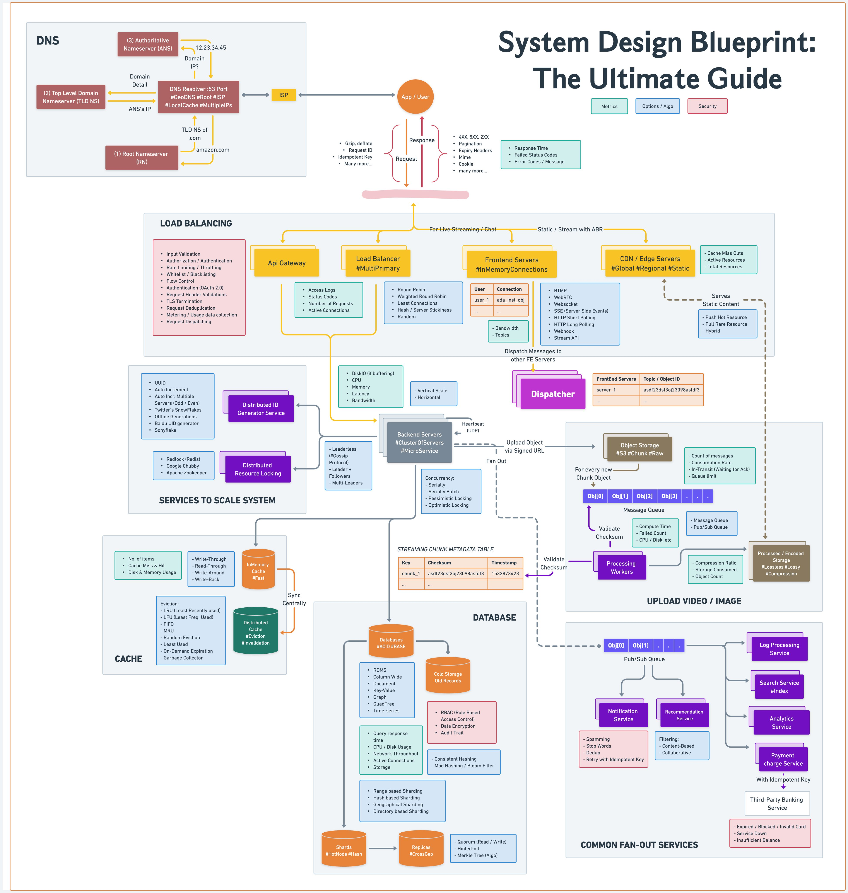
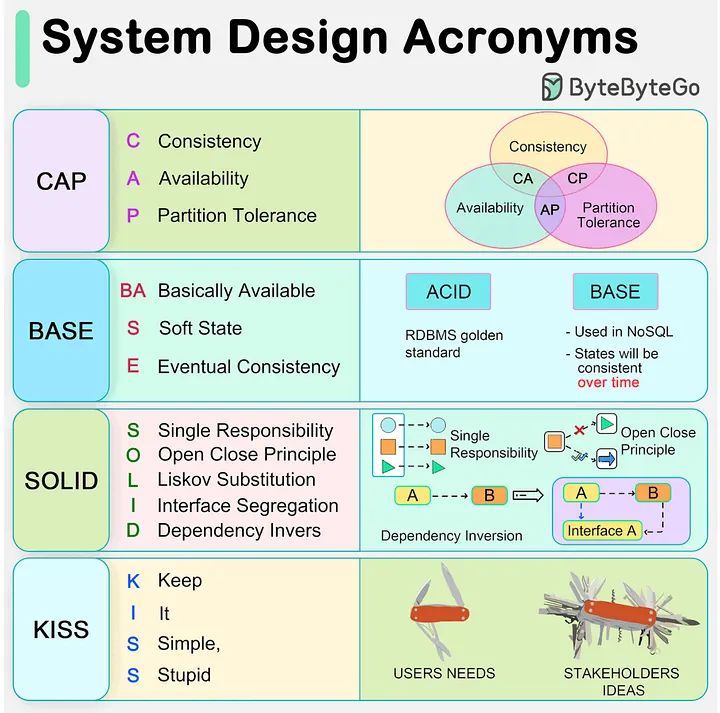
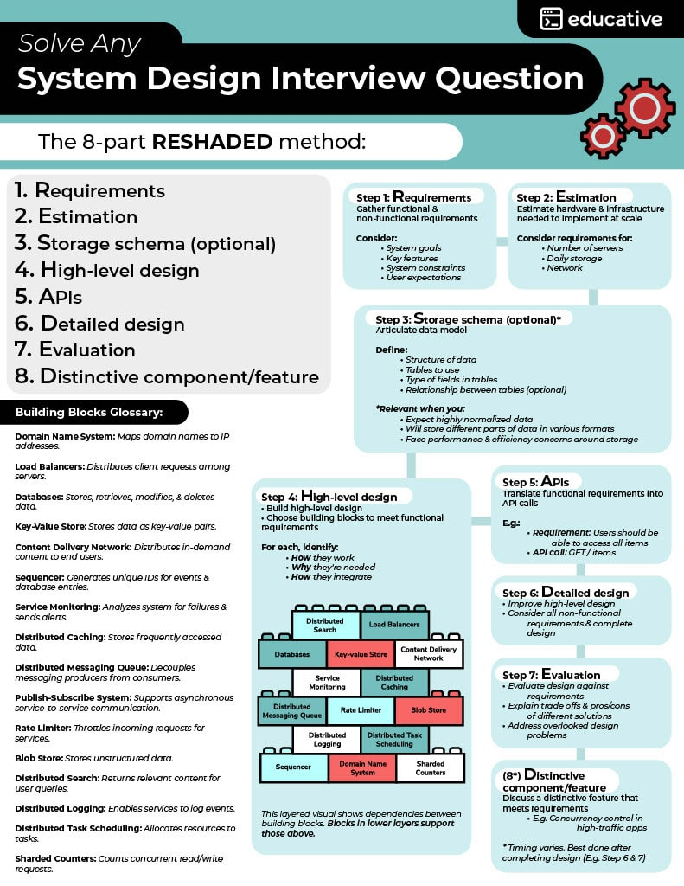
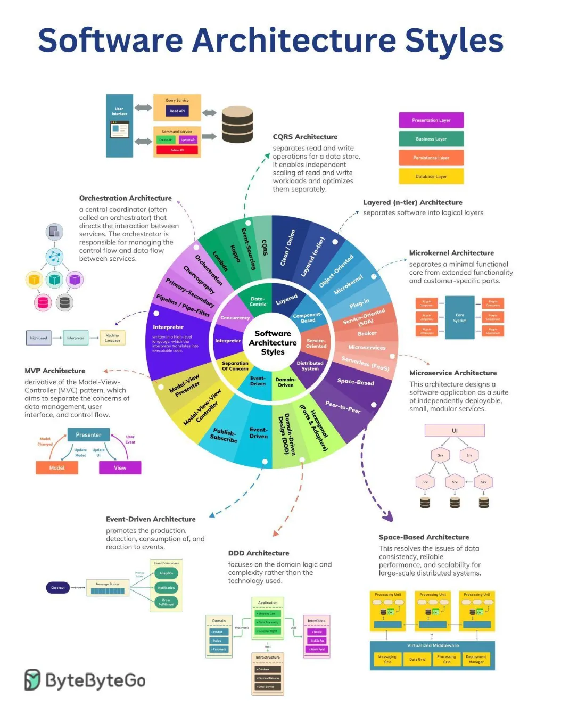
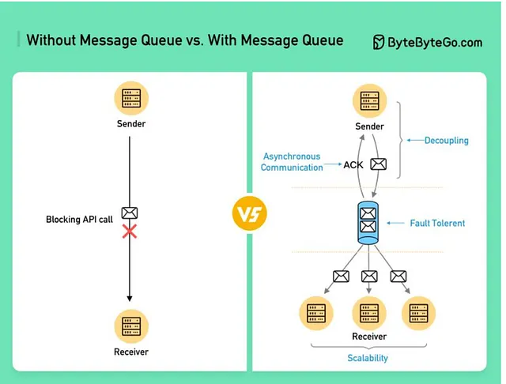
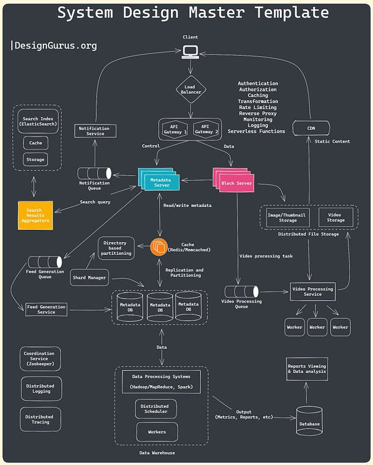
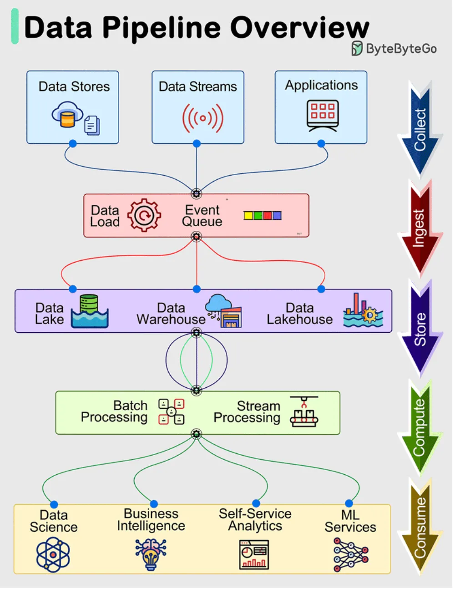

# System Design Summary

[TOC]

## Terminology

---

## Design Principle

### SOLID

The SOLID principles are five essential guidelines that enhance software design, making code more maintainable and scalable.

### DRY

DRY(Don't Repeat Yourself) is a software development principle that says the same logic or knowledge should not be written multiple times in a system.

### KISS

The KISS principle, which stands for "Keep It Simple, Stupid", is a design principle that suggests simplicity should be a key goal in design, development, and other fields, such as engineering, software development, and user interface design.

### YAGNI

"YAGNI" stands for "You Aren't Gonna Need It". YAGNI is a software development principle that advises developers to implement only what is required for current needs.

---

## Workflow

---

## Requirements

### Functional Requirements

Functional requirements are the requirements that the end user specifically demands as basic functionalities that the system should offer. All these functionalities need to be necessarily included into the system as part of the contract.

### Non-Functional Requirements

Non-functional Requirements are the quality constraints that the system must satisfy according to the project contract. The priority or extent to which these factors are implemented varies from one project to another. They are also called non-behavioral requirements. For example: portability, maintainability, reliability, scalability, security, etc.

### Extended requirements

These are basically "nice to have" requirements that might be out of the scope of the system.

---

## Cost Estimation

Software Cost Estimation is a systematic process used to forecast the amount of effort (person-hours or person-months), duration(calendar time), and financial cost required to develop, deploy, and maintain a software product.

---

## High Level Design(HLD)

High Level Design(HLD) is an initial step in the development of applications where the overall structure of a system is planned.

A diagram representing each design aspect is include in the HLD (which is based on business requirements and anticipated results):

- It contains description of hardware, software interfaces, and also user interfaces;
- It is also known as macro level/system, design;
- It is created by solution architect;
- The workflow of the user's typical process is detailed in the HLD, along with performance specifications.

---

## APIs

---

## Dive In

### Load Balancer

### API Gateway

### MQ

### DB

### Caching

### Storage

### CDN

---

## Other

### General Template

### Data Pipeline

## Reference

[1] Ian Sommerville. SOFTWARE ENGINEERING . 9th Edition

[2] [Cracking the System Design Interview Round](https://www.geeksforgeeks.org/system-design/how-to-crack-system-design-round-in-interviews/)

[3] [Difference between High Level Design(HLD) and Low Level Design(LLD)](https://www.geeksforgeeks.org/system-design/difference-between-high-level-design-and-low-level-design/)

[4] [Data Modeling in System Design](https://www.geeksforgeeks.org/system-design/data-modeling-in-system-design/)

[5] [What is Low Level Design or LLD?](https://www.geeksforgeeks.org/system-design/what-is-low-level-design-or-lld-learn-system-design/)

[6] [System Design Introduction - LLD & HLD](https://www.geeksforgeeks.org/system-design/getting-started-with-system-design/)

[7] [100+ Best System Design Resources for Interview and Learning](https://github.com/javabuddy/best-system-design-resources?tab=readme-ov-file)

[8] [EP56: System Design Blueprint: The Ultimate Guide](https://blog.bytebytego.com/p/ep56-system-design-blueprint-the)
