# System Metrics

[TOC]

There are some principal dimensions to dependability:

1. Availability.
2. Reliability.
3. Safety.
4. Security.
5. Repairability.
6. Maintainability.
7. Survivability.
8. Error tolerance.

To develop dependable software, you therefore need to ensure that:

1. You avoid the introduction of accidental errors into the system during software specification and development.
2. You design verification and validation processes that are effective in discovering residual errors that affect the dependability of the system.
3. You design protection mechanisms that guard against external attacks that can compromise the availability or security of the system.
4. You configure the deployed system and its supporting software correctly for its operating environment.

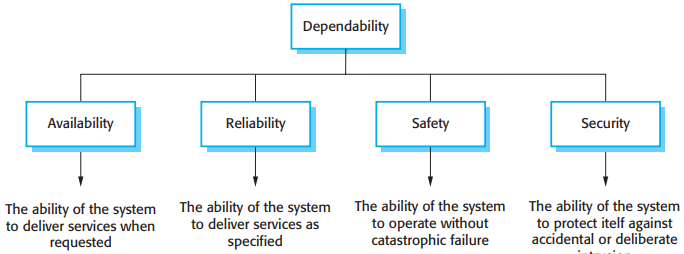

*Principal dependability properties*

## Availability

System **availability** is defined as: The probability that a system, at a point in time, will be operational and able to deliver the requested services.

System faults do not always result in system errors, and system errors do not necessarily result in system failures. The reasons for this are as follows:

1. Not all code in a program is executed.
2. Errors are transient.
3. The system may include fault detection and protection mechanisms.

### Availability Key Concepts

System designers implement various strategies and technologies to achieve high availability, such as:

- Redundancy

  Use redundant servers or components so that, in the event of a failure, another can take over without any problems.

- Load balancing

  Incoming requests are divided among several servers or resources to enhance system performance and fault tolerance while avoiding overload on any one part.

- Failover mechanisms

  Implementing automated processes to detect failures and switch to redundant systems without manual intervention.

- Disaster Recovery(DR)

  Having a comprehensive plan is a way to recover the system in case of a catastrophic event that affects the primary infrastructure.

- Monitoring and Alerting

  putting in place reliable monitoring systems that can identify problems instantly and alert administrators so they can act quickly.

- Performance optimization

  Lowering the possibility of bottlenecks and breakdowns by making sure the system is built and adjusted to efficiently manage the expected load.

- Scalability

  Designing the system to scale easily by adding more resources when needed to accommodate increased demand.

### Availability Measurement

Availability is measured as the percentage of time a system or service is operational and accessible to users over a specific period. It is expressed using the formula:
$$
Availability(\%) = ((Uptime) / (Uptime + Downtime)) * 100;
$$

- $Uptime$: The total time a system is operational and functioning as expected.
- $Downtime$: The total time the system is unavailable due to failures, maintenance, or other issues.

For example: 

If a system has 99.9% availability in a year:

- Total time in a year: $365 \times 24 \times 60 = 525,600$ minutes
- Downtime allowed: $0.1\% \times 525,600 = 525.6$ minutes

---

## Consistency

Consistency plays a crucial role in system design for several reasons:

- Correctness
- Reliability
- Data Integrity
- Concurrency Control
- User Experience

### Types of Consistency

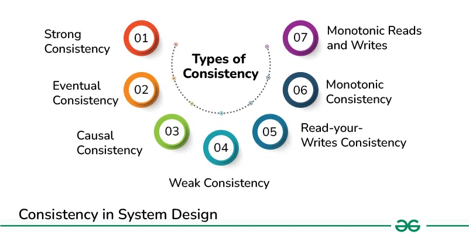

- Strong Consistency

  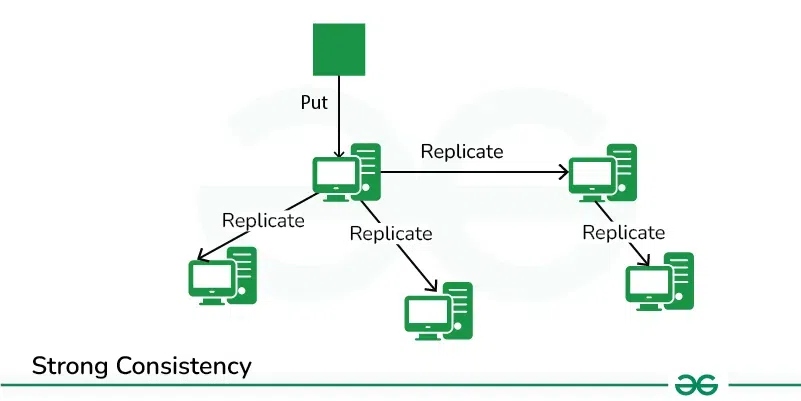

  It guarantees that every read operation receives the most recent write operation's value or an error.

- Eventual Consistency

  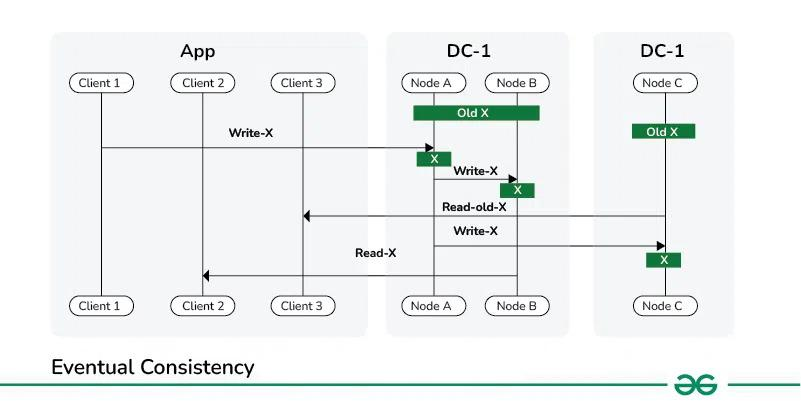

  It guarantees that data replicas will eventually converge to the same value even while it permits them to diverge briefly.

- Causal Consistency

  It ensures that clients observing concurrent events maintain a consistent view of their causality relationship, which is essential for maintaining application semantics and correctness.

- Weak Consistency

  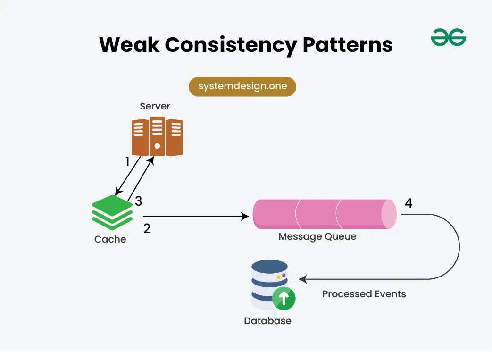

  It just ensures that updates will eventually spread to every duplicate, even though it permits significant differences between them.

- Read-your-Writes Consistency

  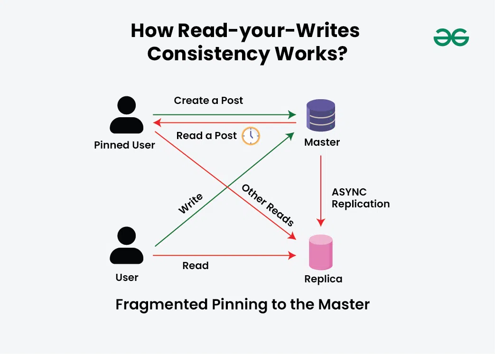

  It guarantees that after a client writes a value to a data item, it will always be able to read that value or any subsequent value it has written.

- Monotonic Consistency

  It ensures that if a client observes a particular order of updates (reads or writes) to a data item, it will never observe a conflicting order of updates.

- Monotonic Reads and Writes

  It guarantees that if a client performs a sequence of reads or writes, it will observe a monotonically increasing sequence of values or updates.

### Strategies for achieving Consistency

Design Patterns and Best Practices

- Single Source of Truth
- Unchanged Operations
- Versioning
- Asynchronous Updates

Consistency Models:

- Eventual Consistency
- Strong Consistency
- Causal Consistency

Conflict Resolution Techniques:

- Last-Writer-Wins(LWW)
- Merge Strategies

### CRDTs (Conflict-free Replicated Data Types)

TODO

---

## Reliability

System **reliability** may be defined more precisely as: The probability of failure-free operation over a specified time, in a given environment, for a specific purpose.

Identify three complementary approaches that are used to improve the reliability of a system:

- Fault avoidance.
- Fault detection and removal.
- Fault tolerance.

### Fault Tolerance

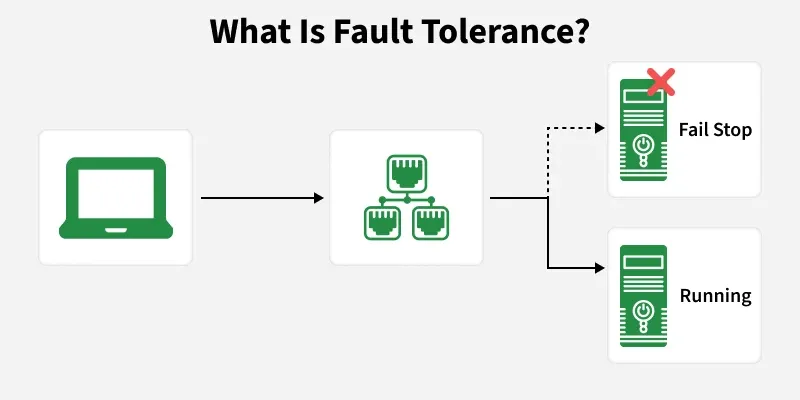

Fault tolerance refers to a system's capacity to keep working even in the face of hardware or software issues. Redundancy, error detection, and error recovery techniques must be used to avoid a costly failure. This will allow the system to continue operating or deteriorate in performance at a slower rate.

### Reliability Specification

Reliability requirements are, therefore, of two kinds:

1. Non-functional requirements, which define the number of failures that are acceptable during normal use of the system, or the time during which the system is unavailable for use. These are quantitative reliability requirements.
2. Functional requirements, which define system and software functions that avoid, detect, or tolerate faults in the software, and so ensure that these faults do not lead to system failure.

#### Functional Reliability Specification

There are three types of functional reliability requirements for a system:

1. Checking requirements
2. Recovery requirements
3. Redundancy requirements

Factors that affect Reliability:

- Design Quality
- Hardware Quality
- Software Bugs
- Maintenance
- Workload
- External Conditions
- Redundancy

#### Non-functional Reliability Requirements

There are several advantages in deriving quantitative reliability specifications:

1. The process of deciding what required level of reliability helps to clarify what stakeholders really need. It helps stakeholders understand that there are different types of system failure, and it makes clear to them that high levels of reliability are very expensive to achieve.
2. It provides a basis for assessing when to stop testing a system. You stop when the system has achieved its required reliability level.
3. It is a means of assessing different design strategies intended to improve the reliability of a system. You can make a judgment about how each strategy might lead to the required levels of reliability.
4. If a regulator has to approve a system before it goes into service (e.g., all systems that are critical to flight safety on an aircraft are regulated), then evidence that a required reliability target has been met is important for system certification.

### Measure Reliability

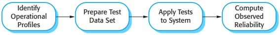

*Reliability measurement*

This conceptually attractive approach to reliability measurement is not easy to apply in practice. The principal difficulties that arise are:

1. Operational profile uncertainty.
2. High costs of test data generation.
3. Statistical uncertainty when high reliability is specified. 
4. Recognizing failure.

#### Metrics of Reliability

The choice of metric depends on the type of system that is being specified and the requirements of the application domain. The metrics are:

1. `Probability of failure on demand (POFOD)` If you use this metric, you define the probability that a demand for service from a system will result in a system failure.
2. `Rate of occurrence of failures (ROCOF)` This metric sets out the probable number of system failures that are likely to be observed relative to a certain time period (e.g., an hour), or to the number of system executions.
3. `Availability (AVAIL)` The availability of a system reflects its ability to deliver services when requested.

#### Reliability Measure Formula

Here's how reliability can be measured with formulas for better clarity:

- Uptime Percentage
  $$
  \text{Uptime Percentage} = ((\text{TotalTime} - \text{Downtime}) / \text{TotalTime}) * 100
  $$

- Mean Time Between Failures (MTBF)
  $$
  \text{MTBF} = (\text{Total Operational Time} / \text{Number of Failures})
  $$

- Mean Time to Repair (MTTR)
  $$
  \text{MTTR} = \text{Total Repair Time} / \text{Number of Failures}
  $$

- Error Rate
  $$
  \text{Error Rate} = (\text{Number of Errors} / \text{Total Transactions or Operations}) * 100
  $$

#### Availability Levels

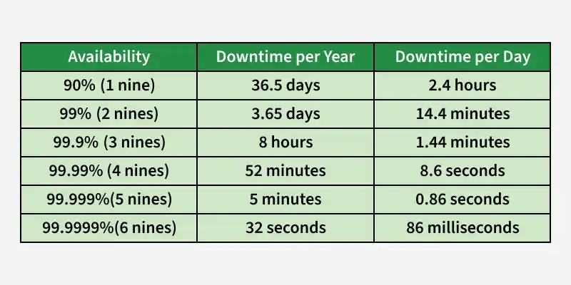

### Horizontal and Vertical Scaling

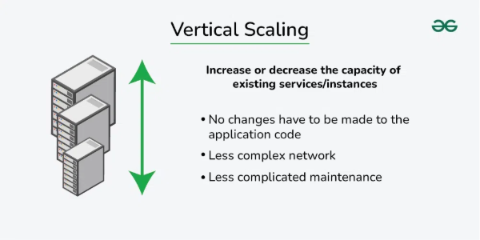

Vertical scaling, also known as scaling up, refers to the process of increasing the capacity or capabilities of an individual hardware or software component within a system.

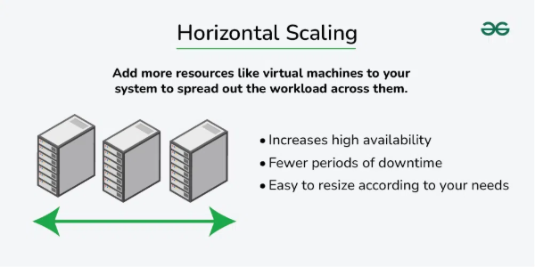

Horizontal scaling, also known as scaling out, refers to the process of increasing the capacity or performance of a system by adding more machines or servers to distribute the workload across a larger number of individual units.

### Achieve High Availability 

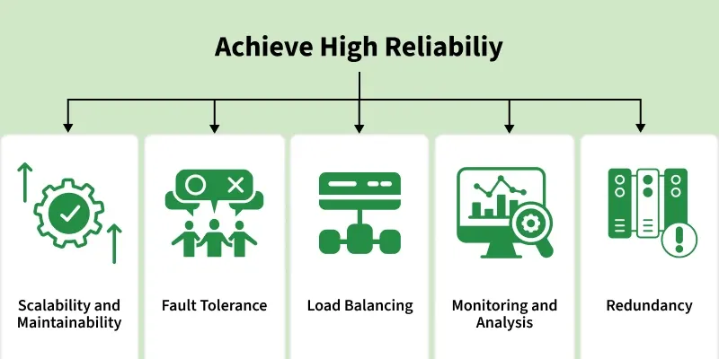

- Scalability and Maintainability

  Scalability and Maintainability ensure the system continues to work efficiently as it grows and evolves over time.

- Fault Tolerance

  Fault Tolerance enables the system to detect errors and recover automatically without failure.

- Load Balancing

  Load Balancing distributes traffic across systems to avoid overload and handle high demand smoothly.

- Monitoring and Analytics

  Monitoring and analytics track performance and help detect issues early.

- Redundancy

  Redundancy duplicates critical components so the system keeps running even if one fails.

#### Redundancy Architectures for High Availability

Redundancy ensures high availability by running multiple system instances so that if one fails, another can continue serving users. It is often combined with data replication to keep data copies across multiple servers for reliability:

1. Hot-Cold Architecture

   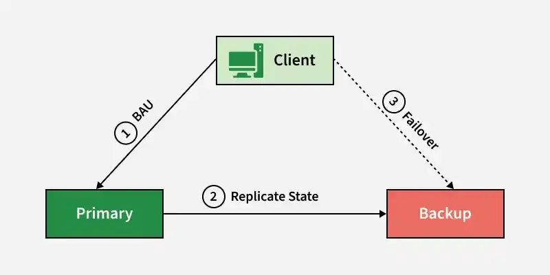

   In this architecture, one server acts as the primary while another server remains as a backup to take over if the primary fails.

2. Hot-Warm Architecture

   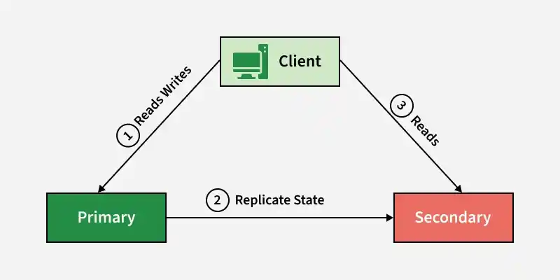

   This architecture allows the secondary server to handle some workload, usually read operations, to utilize resources better.

3. Hot-Hot Architecture

   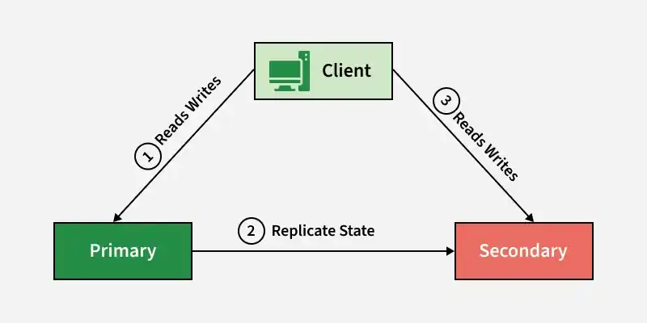

   In this setup, multiple servers work as active nodes and can handle requests simultaneously.

   

### Challanges

#### Single Point of Failure(SPOF)

A `single point of failure(SPOF)` is a system component that, if it fails, can cause the entire system to stop working, making the system less reliable.

To avoiding `single points of failure(SPOFs)`, here are several strategies to help mitigate or eliminate SPOFs:

- Redundancy
- Load Balancing
- Failover
- Regular Testing
- Monitoring & Alerts
- Documentation
- Continuous Improvement

---

## Safety

Safety-critical software falls into two classes:

1. Primary safety-critical software.
2. Secondary safety-critical software.

The key to assuring safety is to ensure either that accidents do not occur or that the consequences of an accident are minimal. This can be achieved in three complementary ways:

1. `hazard avoidance` The system is designed so that hazards are avoided.
2. `hazard detection and removal` The system is designed so that hazards are detected and removed before they result in an accident.
3. `Damage limitation` The system may include protection features that minimize the damage that may result from an accident.

### Safety specification

#### Hazard assessment

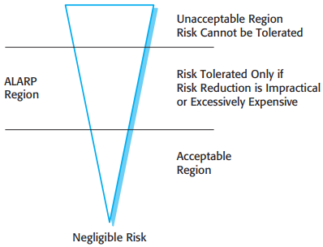

*The risk triangle*

There are three risk categories that you can use in hazard assessment:

1. Intolerable risks in safety-critical systems are those that threaten human life.
2. As low as reasonably practicable (ALARP) risks are those that have less serious consequences or that are serious but have a very low probability of occurrence.
3. Acceptable risks are those where the associated accidents normally result in minor damage.

#### Hazard analysis

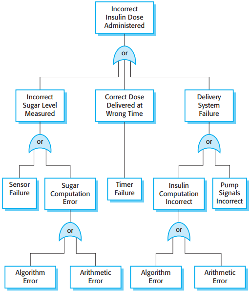

### Risk reduction

1. Once potential risks and their root cause have been identified, you are then able to derive safety requirements that manage the risks and ensure that incidents or accidents do not occur. There are three possible strategies that you can use:

   1. `Hazard avoidance:` The system is designed so that the hazard cannot occur.
   2. `Hazard detection and removal:` The system is designed so that hazards are detected and neutralized before they result in an accident.
   3. `Damage limitation:` The system is designed so that the consequences of an accident are minimized.

### Structured safety arguments

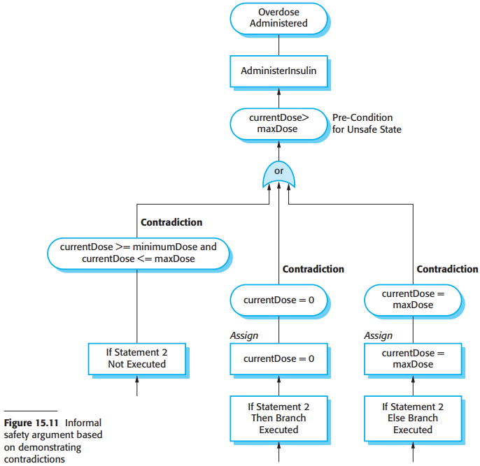

*Informal safety argument based on demonstrating contradictions*

---

## Security

In any networked system, there are three main types of security threats:

1. Threats to the confidentiality of the system and its data.
2. Threats to the integrity of the system and its data.
3. Threats to the availability of the system and its data.

The controls that you might put in place to enhance system security are comparable to those for reliability and safety:

1. Vulnerability avoidance.
2. Attack detection and neutralization.
3. Exposure limitation and recovery.

### Security risk management

Risk assessment stage:

1. Preliminary risk assessment.
2. Life-cycle risk assessment.
3. Operational risk assessment.

### Life-cycle Secure Software Development

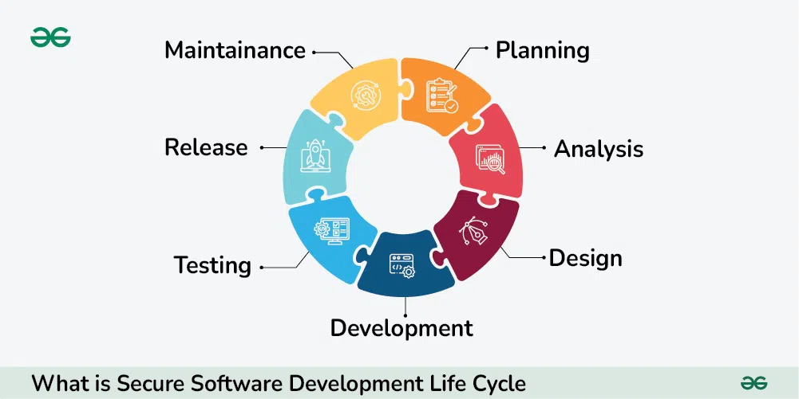

### Life-cycle risk assessment

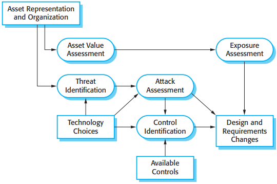

*Life-cycle risk analysis*

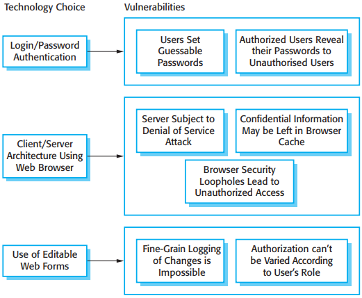

*Vulnerabilities associated with technology choices*

### Design for security

#### Architectural design

In designing a system architecture that maintains security, you need to consider two fundamental issues:

1. Protection--how should the system be organized so that critical assets can be protected against external attack?
2. Distribution--how should system assets be distributed so that the effects of a successful attack are minimized?

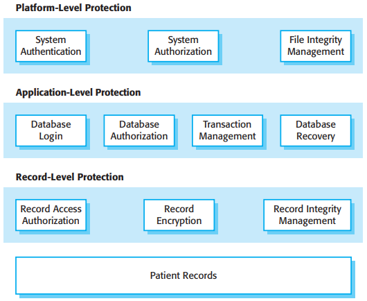

*A layered protection architecture*

#### Design guidelines

Design guidelines for secure systems engineering:

1. Base security decisions on an explicit security policy.
2. Avoid a single point of failure.
3. Fail securely.
4. Balance security and usability.
5. Log user actions.
6. Use redundancy and diversity to reduce risk.
7. Validate all inputs.
8. Compartmentalize your assets.
9. Design for deployment.
10. Design for recoverability.

#### Design for deployment

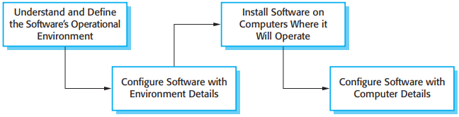

*Software deployment*

Four ways to incorporate deployment support in a system:

1. Include support for viewing and analyzing configurations.
2. Minimize default privileges.
3. Localize configuration settings.
4. Provide easy ways to fix security vulnerabilities.

### Security testing

Fundamentally, there are two reasons why security testing is so difficult:

1. Security requirements, like some safety requirements, are `shall not` requirements.
2. The people attacking a system are intelligent and are actively looking for vulnerabilities that they can exploit.

---

## Maintainability

Maintainability determines how easy and profitable it will be to maintain, update, and do upgrades in that software system. A largely maintainable system contains the following characteristics:

- Modularity
- Readability
- Error Handling
- Utilizes VCS
- Testability

### Measuring Maintainability

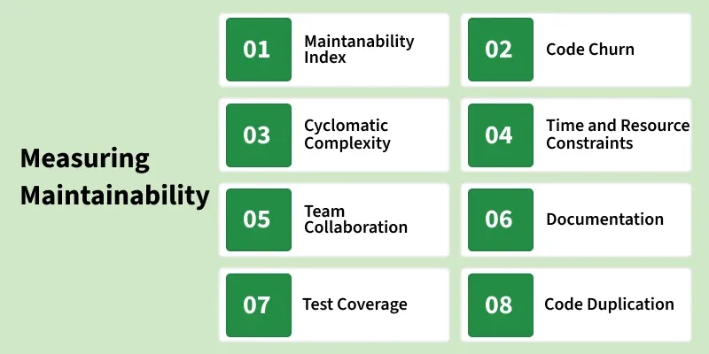

- Maintainability Index

  It provides an overall score that represents the maintainability of a specific component/Code module/Entire system.

- Code Churn

  It measures the frequency of changes to a code module over time using Version Control's data.

- Cyclomatic Complexity

  It measures the complexity of a code module.

- Time and Resource constraints

  It's important to balance between speed of development as well as speed of maintainability.

- Team Collaboration

- Documentation

  Good documentation reduces the learning curve for new Devs and helps the existing team understand it better during maintenance.

- Test Coverage

  It measures the extent to which automated tests cover the codebase, It helps prevent regressions from being introduced.

- Code Duplication

  The Percentage of duplicated code present in the system can be an indicator of maintainability.

### Achieve High Maintainability

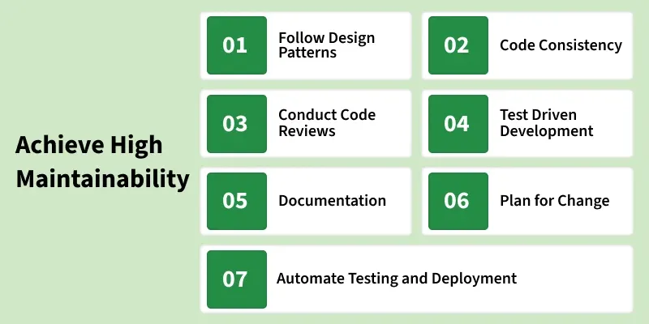

- Follow Design Patterns

  Design patterns and SOLID principle promote modularity and flexibility.

- Code Consistency

  Well-written, readable code with meaningful variables, comments, and documentation makes maintenance tasks even smoother.

- Conduct Code Review

  Code reviews by peers, and maintainers can help in identifying potential issues early on, while making sure that code adheres to maintainability standards and preferred code style or not.

- Test-Driven Development(TDD)

  Adopting TDD ensures that test cases are written before the code implementation, helping developers understand the codebase easily while troubleshooting an issue.

- Documentation

  Good documentation reduces the learning curve for new Devs and helps the existing team understand it better during maintenance.

- Plan for Change

  Design the system in such a way, that makes it easier to add new features and adapt to evolving requirements of daily enhancements.

- Automate Testing and Deployment 

  Automating testing and deployment processes reduces the chance of human error helps maintain the stability of the system during updates and also save time and effort of team members, allowing them to work on important issues.

---

## Scalability

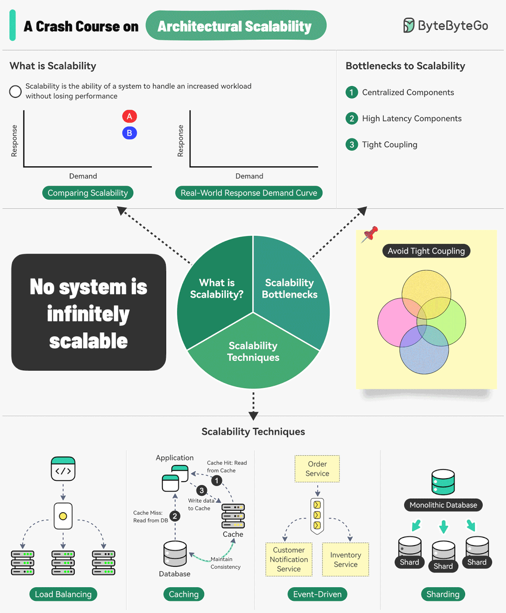

| **Metric**              | **What It Measures**           | **Formula**   |
| :---------------------- | :----------------------------- | :------------ |
| **Speedup**             | Improvement from parallelism   | $T(1) / T(N)$ |
| **Efficiency**          | Utilization of added resources | $Speedup / N$ |
| **Scalability factor**  | Throughput growth              | $λ(N) / λ(1)$ |
| **Latency degradation** | Performance loss under load    | $W(N) / W(1)$ |

### Scalability Patterns

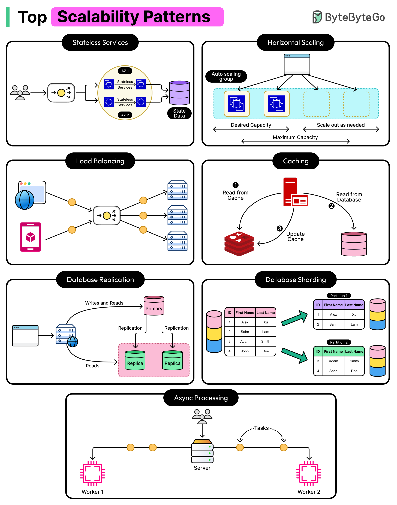

### Factors Affecting Scalability

The factors that affects the scalability with their explanation are:

1. Performance Bottlenecks

   Performance bottlenecks are components or processes in a system that limit overall performance and slow down operations.

   - Performance bottlenecks are parts of a system that slow down overall performance.

   - They are often caused by slow databases, inefficient code, or limited resources.

2. Resource Utilization

   Efficient use of system resources is important to maintain performance and support system scalability.

   - Efficiently using resources such as CPU, memory, and disk space is essential for scalability.
   - Inefficient resource utilization can lead to bottlenecks and limit the system's ability to scale.

3. Network Latency

   Network latency refers to the delay that occurs when data travels between systems or network nodes.

   - Network latency is the delay in data transmission.
   - High latency slows node communication and affects scalability.

4. Data Storage and Access

   The way data is stored and accessed plays a major role in determining how well a system can scale.

   - Data storage and access patterns affect scalability.
   - Distributed databases and caching help systems scale better.

5. Concurrency and Parallelism

   Concurrency and parallelism allow systems to process multiple tasks at the same time to improve performance.

   - Enables handling of multiple tasks simultaneously, improving scalability and system efficiency.
   - Increases throughput by processing more requests, but may introduce latency due to synchronization and overhead if not managed properly.

6. System Architecture

   System architecture determines how components are structured and how easily the system can scale.

   - System architecture defines how easily a system can scale, with modular and loosely coupled components improving flexibility.
   - Supports both horizontal scaling (adding instances) and vertical scaling (upgrading resources) for better performance.

### Scalability Bottlenecks

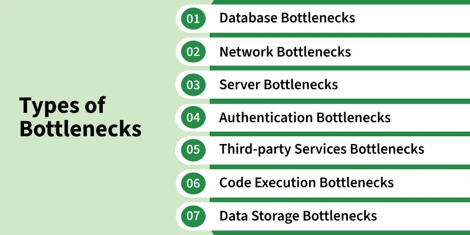

1. Database Bottlenecks

   Many programs rely heavily on databases, which are also frequently the main cause of scalability issues. Performance restrictions in a database system that can limit its capacity to process requests and transactions effectively are known as database bottlenecks.

2. Network Bottlenecks

   Network bottlenecks can significantly hinder scalability in a distributed system. It happen when a certain resource or component restricts a computer network's capacity or performance, which slows down or degrades the system's overall performance.

3. Server Bottlenecks

   When the application server is unable to manage more requests or concurrent connections, a server bottleneck occurs. Limitations in server resources, including CPU, RAM, or disk I/O, may be the cause of this.

4. Authentication Bottlenecks

   Authentication is essential for securely verifying user identities and controlling access to system resources. An authentication bottleneck occurs when this process becomes slow or overloaded, affecting overall system performance and user experience.

5. Third-Party Services Bottlenecks

   For many features, such as cloud storage, geolocation, and payment processing, modern apps frequently rely on third-party services, which limits a system's overall performance, dependability, and scalability.

6. Code Execution Bottlenecks

   In system design, code execution bottlenecks are circumstances in which the design, writing, or execution of software code affects a computer system's performance and efficiency. These bottlenecks can be caused by a variety of factors, including poor use of system resources, high CPU utilization, and slow reaction times.

7. Data Storage Bottlenecks

   When a system's storage mechanisms and infrastructure start to limit its performance, capacity, or dependability, it is said to have a data storage bottleneck. These bottlenecks can impact the overall functionality and efficiency of the system.

---

## Performance

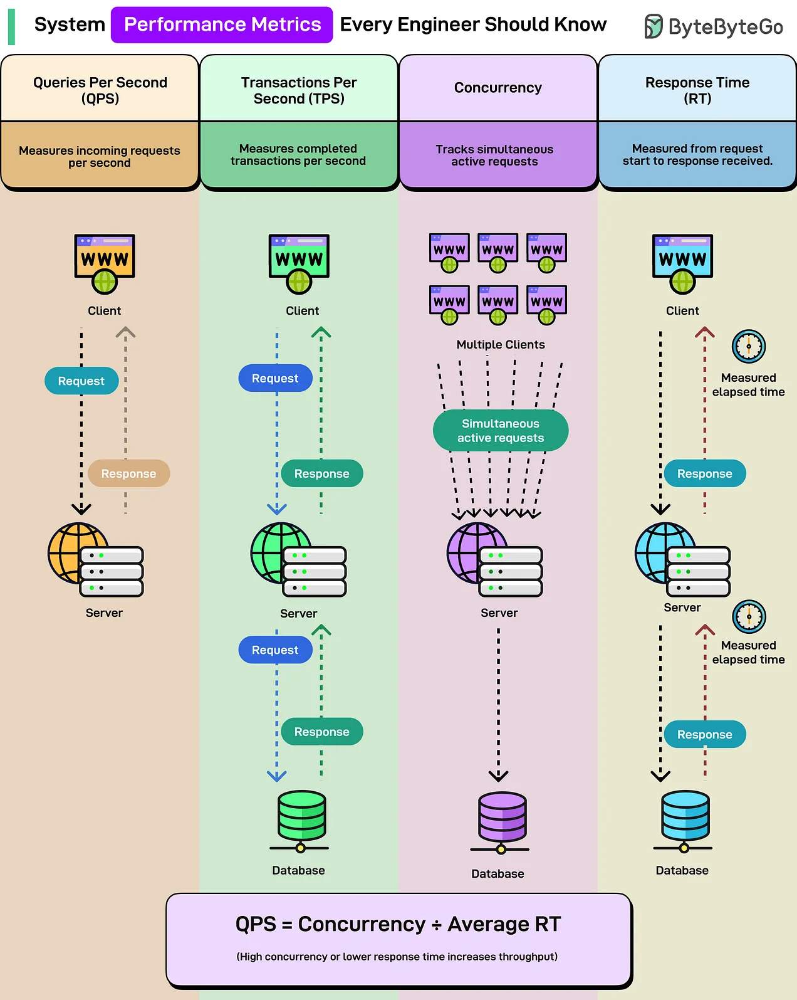

### Latency

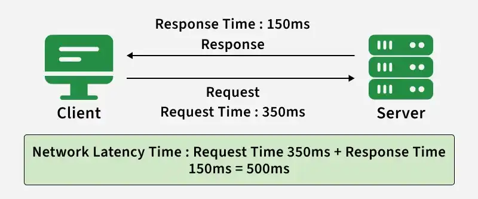

Latency refers to the time taken for a single request to travel from the client to the server, get processed, and return a response. It is essentially the delay experienced by a user.

#### Network Latency

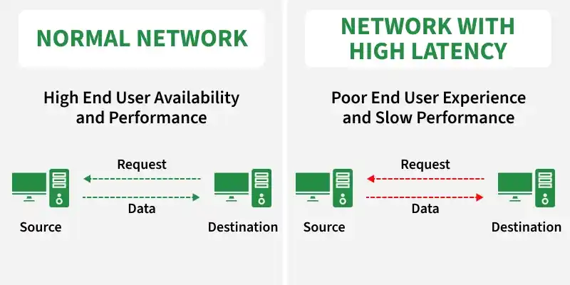

Network latency is the time taken for data to travel from one point to another over a network.
It mainly depends on distance, bandwidth, and network congestion.

#### System Latency

System latency is the total time taken for a request to be processed and responded to, including network, server processing, and client-side rendering.

#### Tail Latency

Tail latency refers to the worst-case response times in a system, usually measured at high percentiles like 95th or 99th percentile instead of average latency.

#### Method to Reduce Latency

Latency can be reduced by optimizing network, system, and data processing techniques:

- Use CDN (Content Delivery Network) to bring data closer to users.
- Reduce network distance (use nearest servers/regions)
- Optimize database queries.
- Use caching to avoid repeated processing.
- Minimize payload size (compression, smaller APIs)

### Throughput

Throughput measures the amount of work a system can handle over a given period of time.

Throughput is influenced by multiple network, hardware, and system-related factors.

- Network Congestion: High traffic reduces available bandwidth, lowering throughput.
- Bandwidth Limitations: Limited network capacity restricts the amount of data transferred.
- Hardware Performance: Slow routers, switches, or servers can reduce data handling capacity.
- Software Efficiency: Poorly optimized code or algorithms can slow down processing.
- Latency: Higher delay can reduce effective data transfer, especially in real-time systems.

#### Network Throughput

Amount of data transferred over a network in a given time; used to measure network performance.

#### Disk Throughput

Speed at which data is read from or written to storage devices (e.g., SSD/HDD).

#### Processing Throughput

Number of operations or tasks a CPU/system can complete per unit time.

#### Methods to Improve Throughput

Throughput can be improved by optimizing network, hardware, and system performance.

- Network Optimization: Use efficient protocols and better routing to reduce delays and packet loss.
- Load Balancing: Distribute traffic across multiple servers to avoid overload and improve performance.
- Hardware Upgrades: Use high-performance routers, switches, and servers to handle more data.
- Software Optimization: Improve code and algorithms to process data faster.
- Compression Techniques: Reduce data size to speed up transmission.
- Caching Strategies: Store frequently used data locally to reduce repeated requests.

### Concurrency

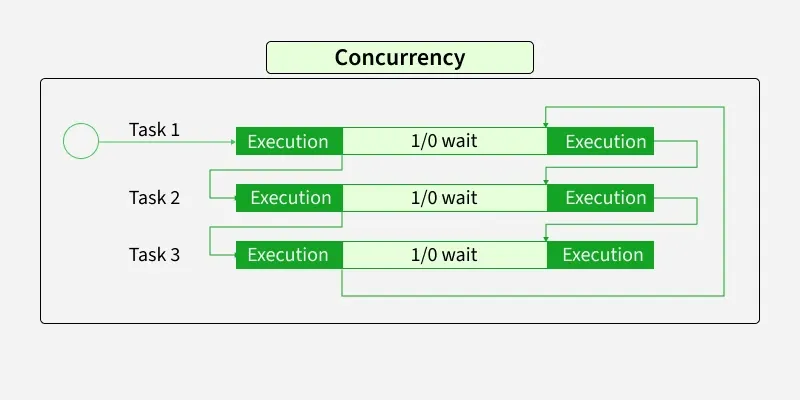

Concurrency refers to handling multiple tasks by sharing a single processing resource, without executing them truly simultaneously. It improves system responsiveness by creating an illusion of parallelism.

### Parallelism

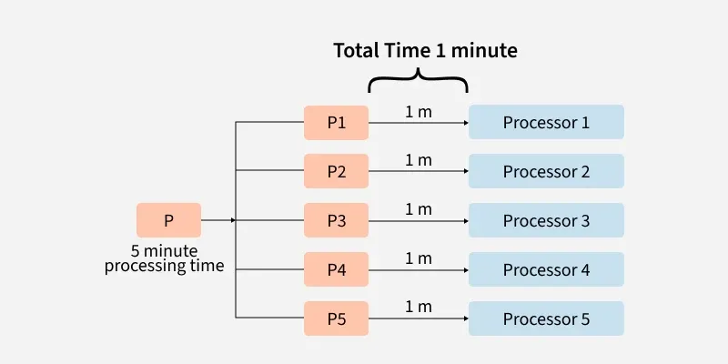

Parallelism refers to executing multiple tasks simultaneously using multiple processing units. It improves system throughput and computational speed by dividing work across processors.

### Amdahl’s law

The main idea is that when we speed up one part of a system, the effect on the overall system performance depends on both how significant this part was and how much it sped up. Consider a system in which executing some application requires time $T_{old}$. Suppose some part of the system requires a fraction $\alpha$ of this time, and that we improve its performance by a factor of $k$. That is, the component originally required time $\alpha T_{old}$, and it now requires time $(\alpha T_{old})/k$. The overall execution time would thus be:

$$
\begin{equation}\begin{split}
T_{new} &= (1 - \alpha)T_{old} + (\alpha T_{old})/k \\
&= T_{old}[(1 - \alpha) + \alpha / k]
\end{split}\end{equation}
$$

From this, we can compute the speedup $S = T_{old} / T_{new}$ as 

$$
S = \frac{1}{(1 - \alpha) + \alpha / k}
$$

One interesting special case of Amdahl's law is to consider the effect of setting $k$ to $\infty$. That is, we are able to take some part of the system and speed it up to the point at which it takes a negligible amount of time. We then get:

$$
S_{\infty} = \frac{1}{(1 - \alpha)}
$$

---

## Summary

### Strategies For Reliability And Fault Tolerance

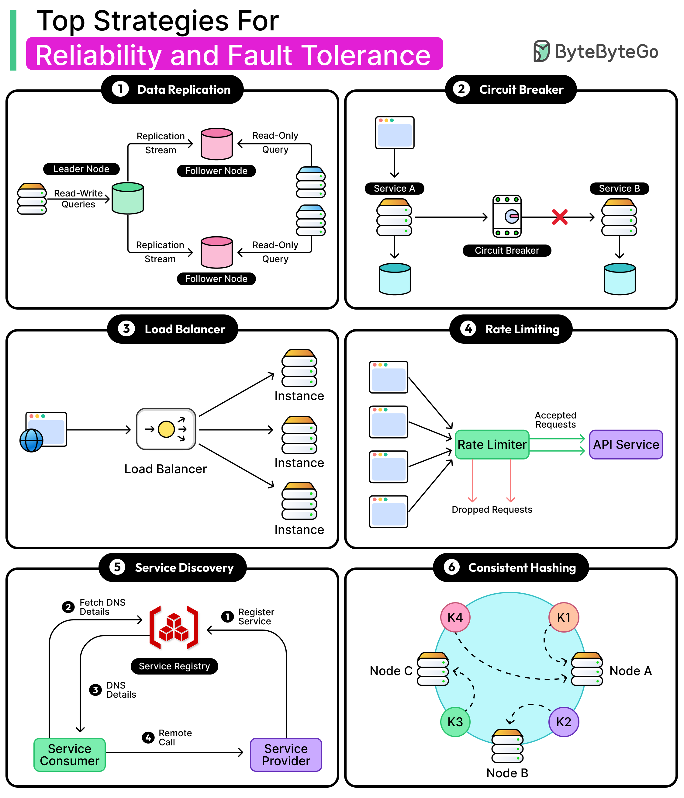

### Strategies For System Performance

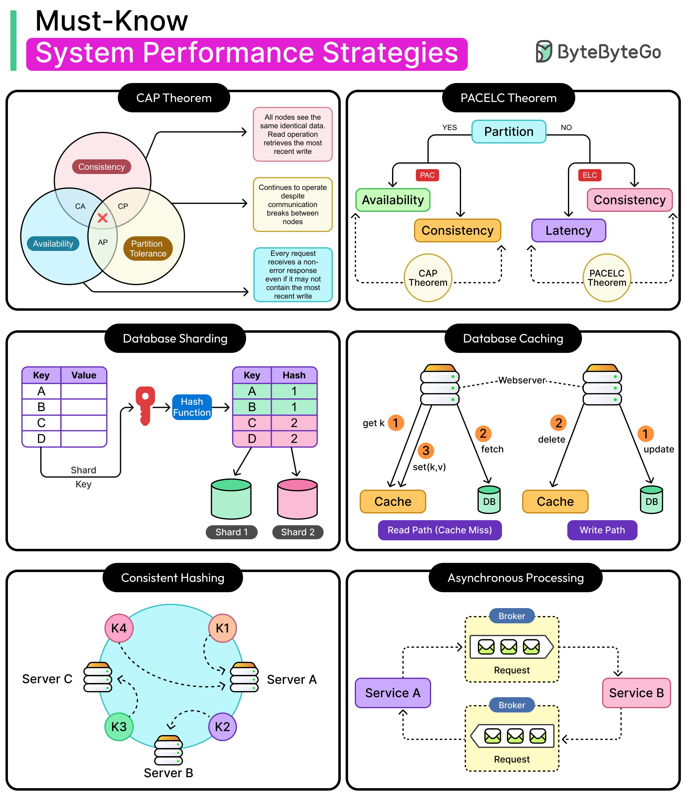

### Strategies For System Availability

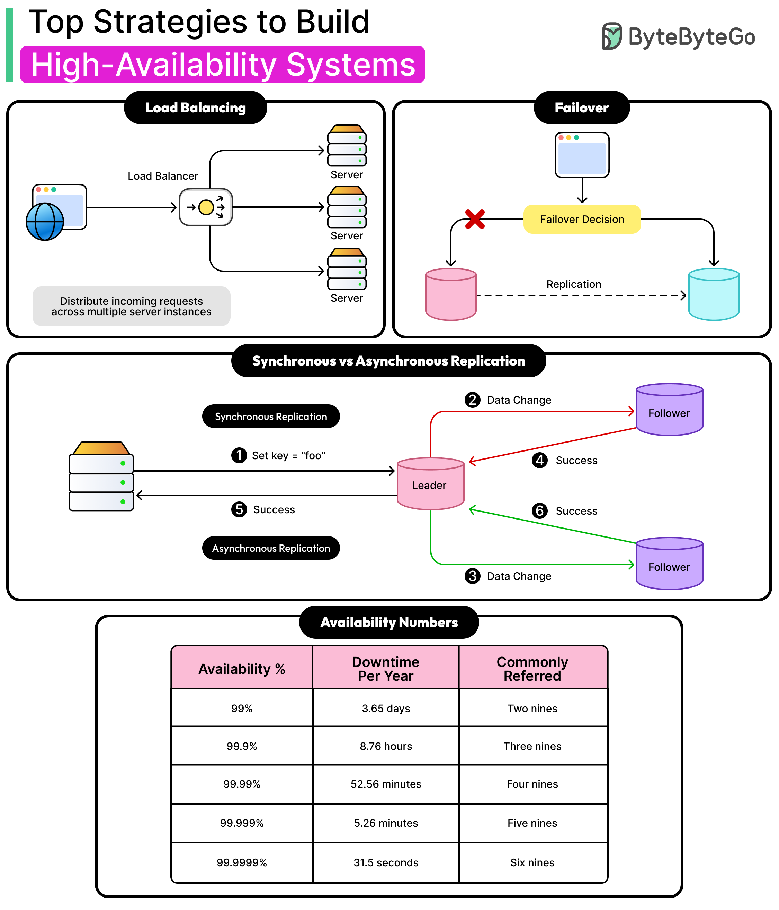

### Strategies To Reduce Latency

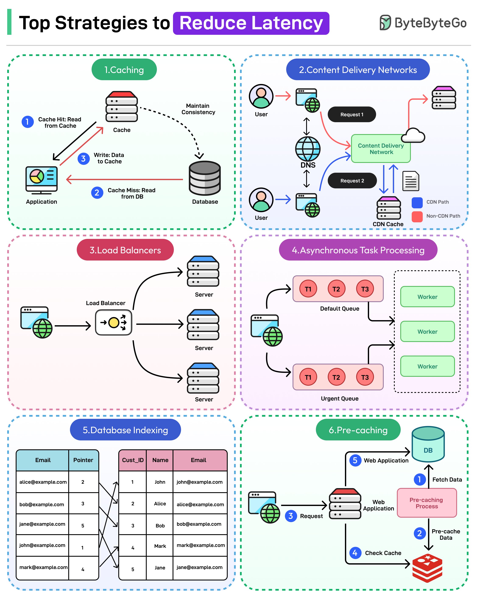

### Horizontal vs Vertical Scaling

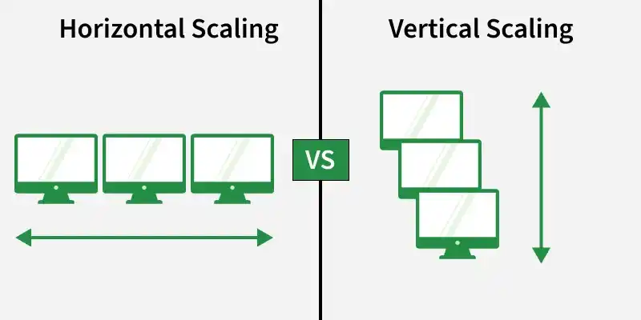

| Horizontal Scaling                                           | Vertical Scaling                                           |
| ------------------------------------------------------------ | ---------------------------------------------------------- |
| Adds more machines or servers to distribute the workload.    | Increases CPU, RAM, or storage of a single machine.        |
| More cost-effective for large-scale systems.                 | Simpler initially but can become expensive over time.      |
| Highly flexible because new servers can be added easily.     | Limited flexibility due to hardware limits.                |
| Better fault tolerance since workload is spread across multiple machines. | Lower fault tolerance because it depends on one machine.   |
| Improves performance by distributing traffic across servers. | Performance improves only up to hardware capacity.         |
| Less risk of single point of failure.                        | Higher risk of single point of failure.                    |
| More complex to manage because it involves distributed systems. | Easier to manage since it uses a single machine.           |
| Suitable for applications requiring massive scalability.     | Suitable for applications with moderate scalability needs. |
| Requires load balancing to distribute traffic across servers. | Load balancing is usually not required.                    |
| Relies on network communication between multiple machines.   | Mostly uses communication within a single machine.         |

### Latency vs Throughput

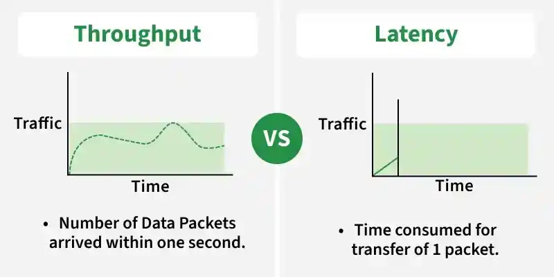

|                         Latency                         |                     Throughput                     |
| :-----------------------------------------------------: | :------------------------------------------------: |
|         Time delay between request and response         |      Amount of data transferred per unit time      |
|              Measured in milliseconds (ms)              |            Measured in bps, Mbps, Gbps             |
|          Represents speed of a single request           |       Represents system or network capacity        |
| Affected by distance, congestion, and processing delays | Affected by bandwidth, congestion, and packet loss |
|           High latency causes slow responses            |      Low throughput causes slow data transfer      |
|                     Measure of time                     |                  Measure of data                   |
|           Critical for real-time applications           |     Important for data-intensive applications      |

### Dependable Programming

There are some good practice guidelines for dependable programming:

1. Limit the visibility of information in a program.
2. Check all inputs for validity.
3. Provide a handler for all exceptions.
4. Minimize the use of error-prone constructs.
5. Provide restart capabilities.
6. Check array bounds.
7. Include timeouts when calling external components.
8. Name all constants that represent real-world values.

### Soft State vs Eventual Consistency

|     **Aspect**     |                        **Soft State**                        |                   **Eventual Consistency**                   |
| :----------------: | :----------------------------------------------------------: | :----------------------------------------------------------: |
|   **Definition**   |  Data correctness can degrade over time if no updates occur  | All accesses to a data item will eventually return the same value if no new updates are made |
|   **Guarantee**    |    No guarantee of consistency at any given point in time    | Guarantee that the system will eventually reach a consistent state |
|   **Use cases**    | Used in systems where strong consistency is impractical or costly | Used in distributed systems to provide high availability and partition tolerance |
| **Implementation** | Typically implemented using policies for data expiration or refresh | Implemented using asynchronous update propagation and conflict resolution |
|    **Example**     | A distributed cache that periodically refreshes or evicts cached data | A distributed database that asynchronously propagates updates to replicas and resolves conflicts over time |

### Strong vs Eventual Consistency

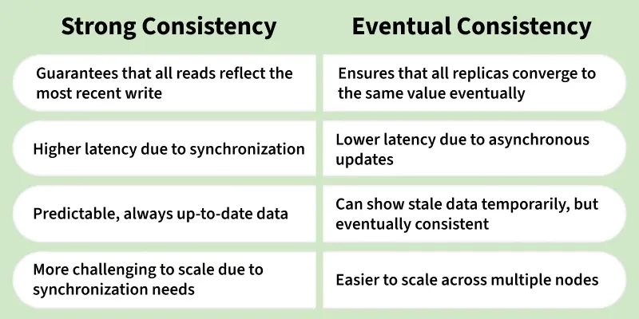

|       **Parameters**       |                    **Strong Consistency**                    |                   **Eventual Consistency**                   |
| :------------------------: | :----------------------------------------------------------: | :----------------------------------------------------------: |
|       **Definition**       |   Guarantees that all reads reflect the most recent write    | Ensures that all replicas converge to the same value eventually |
|     **Data Freshness**     |             Immediate consistency after a write              | Temporary inconsistencies allowed, and eventual consistency  |
|        **Latency**         |            Higher latency due to synchronization             |          Lower latency due to asynchronous updates           |
|      **Availability**      |  Lower availability during network partitions (CAP theorem)  | Higher availability even during network partitions (CAP theorem) |
|  **Partition Tolerance**   |              Can be compromised for consistency              |              Prioritized alongside availability              |
|       **Complexity**       |       More complex to implement due to synchronization       |  Simpler implementation, fewer synchronization requirements  |
|       **Use Cases**        | Financial transactions, inventory management, session management |           Social media feeds, DNS, caching systems           |
|      **Performance**       |      Potentially slower due to synchronization overhead      |         Generally faster due to relaxed consistency          |
| **Consistency Guarantees** |       Provides strong guarantees with linearizability        |        Provides weak guarantees, eventual convergence        |
|  **Conflict Resolution**   |        Minimal conflicts due to immediate consistency        |           Requires conflict resolution mechanisms            |
|    **User Experience**     |             Predictable, always up-to-date data              |  Can show stale data temporarily, but eventually consistent  |
|      **Scalability**       |    More challenging to scale due to synchronization needs    |            Easier to scale across multiple nodes             |
| **Read/Write Operations**  |        Synchronous, ensuring the latest data is read         | Asynchronous, allowing for faster operations but with potential delays in consistency |

### Weak vs Eventual Consistency

|        **Aspect**         |                     **Weak Consistency**                     |                   **Eventual Consistency**                   |
| :-----------------------: | :----------------------------------------------------------: | :----------------------------------------------------------: |
|    **Synchronization**    |       Lack of strict synchronization between replicas        |             Asynchronous replication of updates              |
| **Convergence Guarantee** |        No guarantee of convergence or synchronization        |         Guarantees eventual convergence of replicas          |
| **Divergence Tolerance**  |        Allows significant divergence between replicas        |       Tolerates temporary divergence between replicas        |
| **Timing of Convergence** |          No specification on timing of convergence           |    Ensures eventual convergence but does not specify time    |
|  **Ordering of Updates**  |        No strict requirements on ordering of updates         |               Allows loose ordering of updates               |
|       **Use Cases**       | Frequently used in caching systems and certain non-critical data scenarios | Commonly employed in distributed databases, cloud storage, and CDN |
| **Impact on Performance** | Offers potential performance benefits due to reduced synchronization overhead | May introduce temporary inconsistencies but provides eventual consistency and scalability benefits |

### Consistency vs Availability

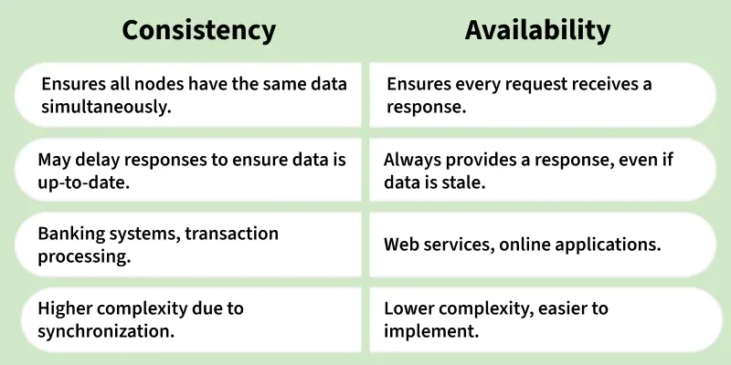

|      **Feature**      |                   **Consistency**                    |                  **Availability**                  |
| :-------------------: | :--------------------------------------------------: | :------------------------------------------------: |
|    **Definition**     | Ensures all nodes have the same data simultaneously. |     Ensures every request receives a response.     |
|   **Primary Goal**    |             Data accuracy and integrity.             |       Service continuity and responsiveness.       |
| **Response Behavior** |  May delay responses to ensure data is up-to-date.   | Always provides a response, even if data is stale. |
|    **Trade-offs**     |   May sacrifice availability for data correctness.   |    May sacrifice consistency for higher uptime.    |
| **Typical Use Cases** |       Banking systems, transaction processing.       |         Web services, online applications.         |
| **CAP Theorem Focus** |         Consistency and Partition Tolerance.         |       Availability and Partition Tolerance.        |
|    **Complexity**     |      Higher complexity due to synchronization.       |       Lower complexity, easier to implement.       |
| **Failure Handling**  |   May reject requests to ensure data consistency.    | Always responds to requests, even during failures. |

### Fault Tolerance vs High Availability Load Balancing

|                       Fault Tolerance                        |               High Availability Load Balancing               |
| :----------------------------------------------------------: | :----------------------------------------------------------: |
| Ensures the system continues working even if some components fail. | Distributes workload across multiple servers to keep the system available. |
|     Goal: Maintain system functionality during failures.     |  Goal: Maximize uptime and efficiently distribute traffic.   |
| Uses techniques like redundancy, replication, failover, and error handling. | Uses techniques like load balancing algorithms, health checks, and traffic distribution. |
| Requires high redundancy where multiple components perform the same task. | Uses moderate redundancy to distribute traffic and avoid overload. |
| Focuses on preventing system failure even during component crashes. | Focuses on keeping services available and responsive to users. |
| Example: RAID storage systems or replicated distributed databases. | Example: Load balancers like NGINX or HAProxy distributing traffic across servers. |
| May slightly reduce performance due to extra checks and replication. | Usually improves performance by balancing requests across servers. |

### Fault Tolerance vs Availability

|                         Availability                         |                       Fault Tolerance                        |
| :----------------------------------------------------------: | :----------------------------------------------------------: |
| Measures how often a system is operational and accessible to users. | Measures the system’s ability to continue working even when failures occur. |
|    Focuses on maximizing uptime and minimizing downtime.     |  Focuses on handling failures without stopping the system.   |
|     Usually measured as uptime percentage (e.g., 99.9%).     |            Measured using MTBF and MTTR metrics.             |
| Uses strategies like load balancing, failover, and redundancy. | Uses redundant components, replication, and graceful degradation. |
|    Ensures consistent access and better user experience.     |    Ensures the system keeps functioning during failures.     |
|   Common in web services, banking, and e-commerce systems.   | Common in safety-critical systems like healthcare or aerospace. |
| May include redundancy but some failure impact can still occur. |   Requires higher redundancy to avoid system-wide failure.   |

### Reliability vs Availability

|                         Reliability                          |                         Availability                         |
| :----------------------------------------------------------: | :----------------------------------------------------------: |
| Reliability is the ability of a system to perform its intended functions correctly for a specific period of time without failure. | Availability is the percentage of time a system remains operational and accessible to users. |
| It focuses on failure-free operation over a period of time.  | It focuses on whether the system is working at a specific moment. |
| Measured using metrics like Mean Time Between Failures (MTBF) and Mean Time To Repair (MTTR). | Measured as uptime percentage, such as 99%, 99.9%, or 99.99%. |
| It is considered a long-term measure of system performance and stability. | It is often considered a short-term measure of system accessibility. |
|           A reliable system fails less frequently.           |  A highly available system recovers quickly from failures.   |
| Focuses on reducing system failures through good design and quality components. | Focuses on minimizing downtime using redundancy and failover mechanisms. |
| Example: A database that rarely crashes over months is considered reliable. | Example: A website that quickly recovers after a server crash is considered highly available. |

### Concurrency vs Parallelism

|                       **Concurrency**                        |                       **Parallelism**                        |
| :----------------------------------------------------------: | :----------------------------------------------------------: |
| Concurrency is the task of running and managing the multiple computations at the same time. | While parallelism is the task of running multiple computations simultaneously. |
| Concurrency is achieved through the interleaving operation of processes on the central processing unit(CPU) or in other words by the context switching. | While it is achieved by through multiple central processing units(CPUs). |
|  Concurrency can be done by using a single processing unit.  | While this can't be done by using a single processing unit. it needs multiple processing units. |
| Concurrency increases the amount of work finished at a time. | While it improves the throughput and computational speed of the system. |
|    Concurrency deals with a lot of things simultaneously.    |        While it does a lot of things simultaneously.         |
| Concurrency is the non-deterministic control flow approach.  |       While it is deterministic control flow approach.       |
|            In concurrency debugging is very hard.            | While in this debugging is also hard but simple than concurrency. |

### Cost vs Performance

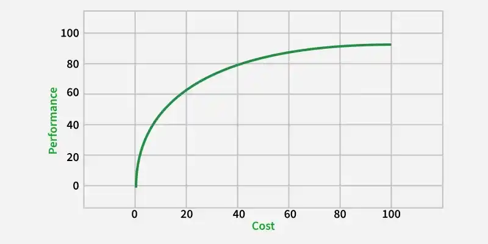

|                     **Cost**                      |                    **Performance**                    |
| :-----------------------------------------------: | :---------------------------------------------------: |
|  Money required to build and maintain the system  |           How efficiently the system works            |
| Focuses on budget, infrastructure, and resources  |    Focuses on speed, efficiency, and response time    |
| Lower cost may reduce system quality or features  |      Higher performance improves user experience      |
| Increasing cost often increases system capability | Performance improves with better resources and design |
|           Goal is to minimize expenses            |            Goal is to maximize efficiency             |

---

## Reference

[1] Ian Sommerville. SOFTWARE ENGINEERING . 9th Edition

[2] Randal E. Bryant;David R. O'Hallaron . COMPUTER SYSTEMS: A PROGRAMMER'S PERSPECTIVE . 3ED

[3] [Availability in System Design](https://www.geeksforgeeks.org/system-design/availability-in-system-design/)

[4] [Reliability in System Design](https://www.geeksforgeeks.org/system-design/reliability-in-system-design/)

[5] [Essential Security Measures in System Design](https://www.geeksforgeeks.org/system-design/essential-security-measures-in-system-design/)

[6] [Horizontal and Vertical Scaling | System Design](https://www.geeksforgeeks.org/system-design/system-design-horizontal-and-vertical-scaling/)

[7] [What is Latency?](https://www.geeksforgeeks.org/computer-networks/what-is-latency/)

[8] [Difference Between Latency and Throughput](https://www.geeksforgeeks.org/computer-networks/difference-between-latency-and-throughput/)

[9] [Availability in Distributed System](https://www.geeksforgeeks.org/computer-networks/availability-in-distributed-system/)

[10] [A Crash Course on Architectural Scalability](https://blog.bytebytego.com/p/ep145-infrastructure-as-code-landscape)

[11] [Scalability Patterns for Modern Distributed Systems](https://blog.bytebytego.com/p/scalability-patterns-for-modern-distributed)

[12] [Top Strategies to Improve Reliability in Distributed Systems](https://blog.bytebytego.com/p/top-strategies-to-improve-reliability)

[13] [System Performance Metrics Every Engineer Should Know](https://blog.bytebytego.com/p/ep194-evolution-of-http)

[14] [Must-Know System Performance Strategies](https://blog.bytebytego.com/p/must-know-system-performance-strategies)

[15] [Top Strategies to Build High Availability Systems](https://blog.bytebytego.com/p/top-strategies-to-build-high-availability)

[16] [Scalability in System Design](https://www.geeksforgeeks.org/system-design/what-is-scalability/)

[17] [Horizontal and Vertical Scaling | System Design](https://www.geeksforgeeks.org/system-design/system-design-horizontal-and-vertical-scaling/)

[18] [Primary Scalability Bottlenecks in System Design](https://www.geeksforgeeks.org/system-design/primary-bottlenecks-that-hurt-the-scalability-of-an-application-system-design/)

[19] [Read-your-Writes Consistency in System Design](https://www.geeksforgeeks.org/system-design/read-your-writes-consistency-in-system-design/)

[20] [Difference between Soft State and Eventual Consistency?](https://www.geeksforgeeks.org/system-design/difference-between-soft-state-and-eventual-consistency/)

[21] [Strong Vs Eventual Consistency in System Design](https://www.geeksforgeeks.org/system-design/strong-vs-eventual-consistency-in-system-design/)

[22] [Weak vs. Eventual Consistency in System Design](https://www.geeksforgeeks.org/system-design/weak-vs-eventual-consistency-in-system-design/)

[23] [Consistency vs. Availability in System Design](https://www.geeksforgeeks.org/system-design/consistency-vs-availability-in-system-design/)

[24] [High Availability in System Design](https://www.geeksforgeeks.org/system-design/what-is-high-availability-in-system-design/)

[25] [Availability in System Design](https://www.geeksforgeeks.org/system-design/availability-in-system-design/)

[26] [Difference between Concurrency and Parallelism](https://www.geeksforgeeks.org/operating-systems/difference-between-concurrency-and-parallelism/)

[27] [Latency and Throughput in System Design](https://www.geeksforgeeks.org/system-design/latency-in-system-design/)

[28] [Cost Vs Performance](https://www.geeksforgeeks.org/system-design/cost-vs-performance/)
