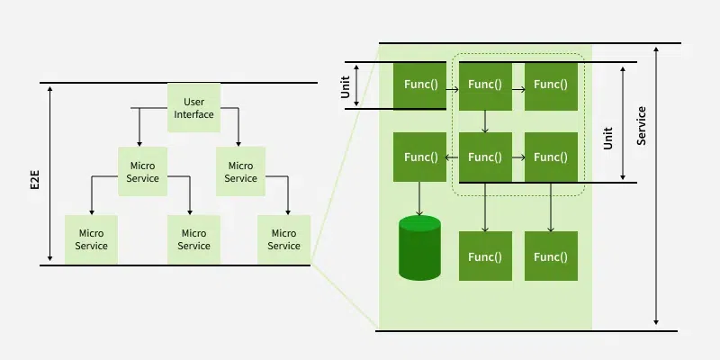
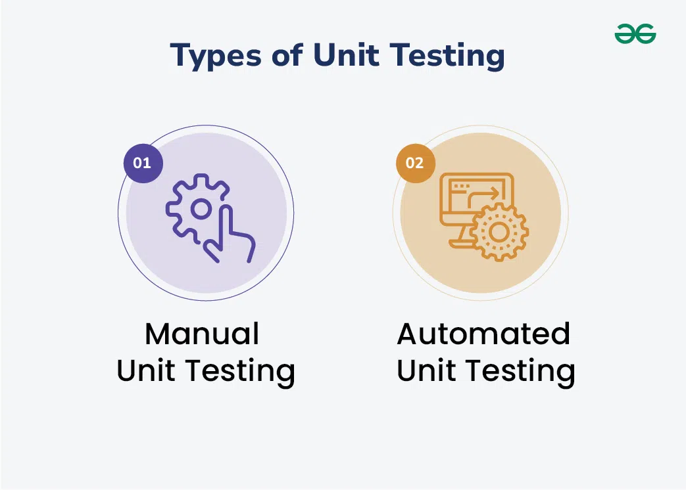
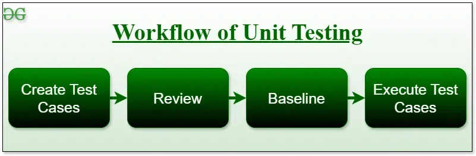
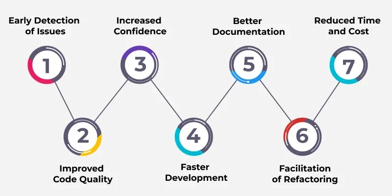
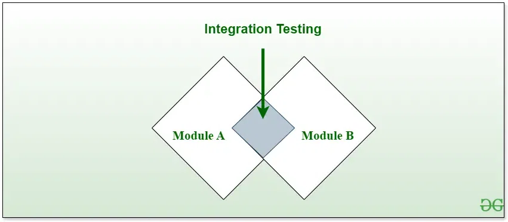
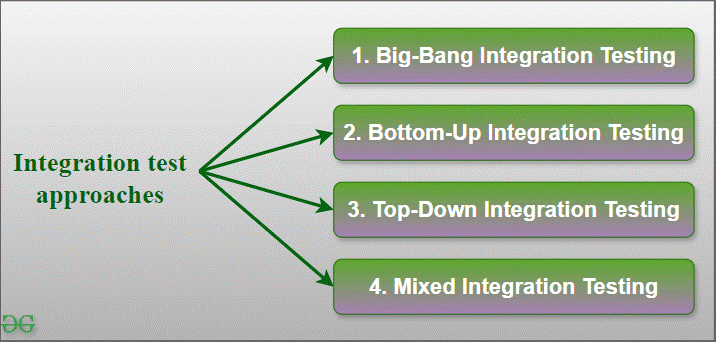
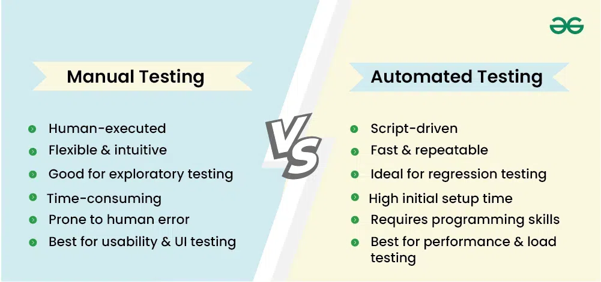

# Testing

[TOC]

## Unit Testing

A unit test is a small piece of code that checks if a specific function or method in is an application works correctly. It will work as the function inputs and verifying the outputs. These tests check that the code work as expected based on teh logic the developer intended.

### Strategy

To create effective unit tests, follow these basic techniques to ensure all scenarios are covered:

- Logic checks
- Boundary checks
- Error handling
- Object-oriented checks

### Types

- Manual Unit Testing

  Manual Testing is like checking each part of a project by hand, withotu using any special tools. People, like developers, do each step of teh testing themselves.

- Automated Unit Testing

  Automated Unit Testing is a way of checking if software works correctly without lots of human effort. We use special tools made by people to run these tests automatically. These are part of the process of building the software.

### Workflow

### Benefit

- Early Detection of Issues
- Improved Code Quality
- Increased Confidence
- Faster Development
- Better Documentation
- Facilitation of Refactoring
- Reduced Time and Cost

### Disadvantage

- Time and Effort
- Dependence on Developers
- Difficulty in Testing Complex Units
- Difficulty in Testing Interactions
- Difficulty in Testing User Interfaces
- Over-reliance on Automation
- Maintenance Overhead

## Integration Testing

Integration Testing is a software testing technique that focuses on verifying the interactions and data exchange between different components or modules of a software application. The goal of integration testing is to identify any problems or bugs that arise when different components are combined and interact with each other.

### Types

1. Big-Bang Integration Testing

   Advantags:

   - it is convenient for small systems.
   - Simple and straightforward approach.
   - Can be completed quickly.
   - Does not require a lot of planning or coordination.
   - May be suitable for small systems or projects with a low degree of interdependence between components.

   Disadvantages:

   - There will be quite a lot of delay because you would have to wait for all teh modules to be integrated.
   - High-risk critical modules are not isolated and tested on priority since all modules are tested at once.
   - Not good for long projects.
   - High risk of integration problems that are difficult to identify and diagnose.
   - This can result in long and complex debugging and troubleshooting efforts.
   - May not provide enough visibility into the interactions and data exchange between components.
   - This can result in a lack of confidence in the system's stability and reliability.
   - This can lead to decreased efficiency and productivity.
   - This may result in a lack of confidence in the development team.
   - This can lead to system failure and decreased user satisfaction.

2. Bottom-Up Integration Testing

   Advantages:

   - In bottom-up testing, no stubs are required.
   - A principal advantage of thsi integration testing is that several disjoint subsystems can be tested simultaneously.
   - It is easy to create the test conditions.
   - Best for applications that uses bottom up design approach.
   - It is easy to observe the test results.

   Disadvantages:

   - Driver modules must be produced.
   - In this testing, the complexity that occurs when the system is made up of a large number of small subsystems.
   - As far modules have been created, there is no working model can be represented.

3. Top-Down Integration Testing

   Advantages:

   - Separately debugged module.
   - Few or no drivers needed.
   - It is more stable and accurate at the aggregate level.
   - Easier isolation of interface errors.
   - In this, design defects can be found in the early stages.

   Disadvantages:

   - Needs many stubs.
   - Modules at lower level are tested inadequately.
   - It is difficult to observe the test output.
   - It is difficult to stub design.

4. Mixed Integration Testing

   Advantages:

   - Mixed approach is useful for very large projects having several sub projects.
   - This Sandwich approach overcomes this shortcoming of the top-down and bottom-up approaches.
   - Parallel test can be performed in top and bottom layer tests.

   Disadvantages:

   - For mixed integration testing, it requires very high cost because one part has a Top-down approach while another part has a bottom-up approach.
   - This integration testing cannot be used for smaller systems with huge interdependence between different modules.

## Functional Testing

TODO

## Performance Testing

TODO

## Acceptance Testing

TODO

## Security Testing

TODO

## Summary

### Manual Testing vs Automated Testing

| Parameters                | Manual Testing                                               | Automation Testing                                           |
| ------------------------- | ------------------------------------------------------------ | ------------------------------------------------------------ |
| Definition                | In manual testing, the test cases are executed by the human tester. | In automated testing, the test cases are executed by the software tools. |
| Processing Time           | Manual testing is time-consuming.                            | Automation testing is faster than manual testing.            |
| Resources Requirement     | Manual testing takes up human resources.                     | Automation testing takes up automation tools and trained employees. |
| Exploratory Testing       | Exploratory testing is possible in manual testing.           | Exploratory testing is not possible in automation testing.   |
| Framework Requirement     | Manual testing doesn't use frameworks.                       | Automation testing uses frameworks like Data Driven, Keyword, etc. |
| Reliability               | Manual testing is not reliable due to the possibility of manual errors. | Automated testing is more reliable due to the use of automated tools and scripts. |
| Investment                | In manual testing, investment is required for human resoruces. | In automated testing, investment is required for tools and automated engineers. |
| Test Results Availability | In manual testing, the test results are recorded in an excel sheet so they are not readily available. | In automated testing, the test results are readily available to all the stakeholders in the dashboard of the automated tool. |
| Human Intervention        | Manual testing allows human observation, thus it is useful in developing user-friendly systems. | Automated testing is conducted by automated tools and scripts so it does not involve assurance of user-friendlines. |
| Performance Testing       | Impractical for systematic performance testing(e.g., load, stress, spike testing) | Supports performance testing(e.g., load, stress, spike testing with tools like JMeter). |
| Batch Testing             | In manual testing, batch testing is not possible.            | You can batch multiple tests for fast execution.             |
| Programming Knowledge     | There is no need for programming knowledge in manual testing. | Programming knowledge is a must in case of automation testing as using tools requires trained staff. |
| Documentation             | In manual testing, there is no documentation.                | In automation teting, the documentation acts as a training resource for new developer. He/She can look into unit test cases and understand the code base quickly. |
| When To Use?              | Manual testing is usable for Exploratory testing, Usability testing, and Adhoc testing. | Automated testing is suitable for Regression testing, Load testing, and Performance testing. |

## Reference

[1] [Unit Testing - Software Testing](https://www.geeksforgeeks.org/software-testing/unit-testing-software-testing/)

[2] [Integration Testing - Software Engineering](https://www.geeksforgeeks.org/software-testing/software-engineering-integration-testing/)