# Testing

[TOC]

## Unit Testing

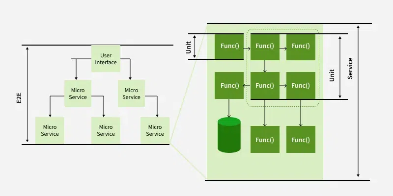

A unit test is a small piece of code that checks if a specific function or method in an application works correctly. It will work as the function inputs and verify the outputs. These tests check that the code works as expected based on the logic the developer intended.

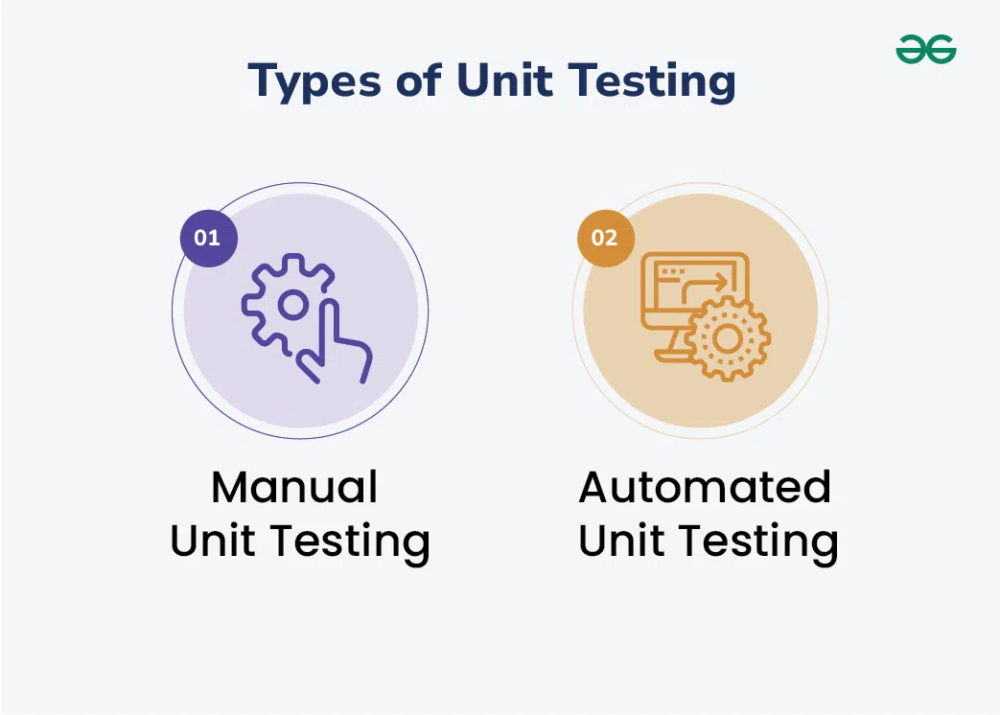

- Manual Unit Testing

  Manual Testing is like checking each part of a project by hand, withotu using any special tools. People, like developers, do each step of teh testing themselves.

- Automated Unit Testing

  Automated Unit Testing is a way of checking if software works correctly without lots of human effort. We use special tools made by people to run these tests automatically. These are part of the process of building the software.
  
### Unit Testing Strategy

To create effective unit tests, follow these basic techniques to ensure all scenarios are covered:

  - Logic checks

    Verify that calculations are correct and all logical paths in the code are executed as expected.

  - Boundary checks

    Test normal, edge, and invalid inputs to ensure the system handles limits correctly.

  - Error handling

    Ensure the system responds properly to errors instead of crashing.

  - Object-Oriented Checks

    Confirm that object states are correctly updated after method execution.

### Unit Testing Workflow

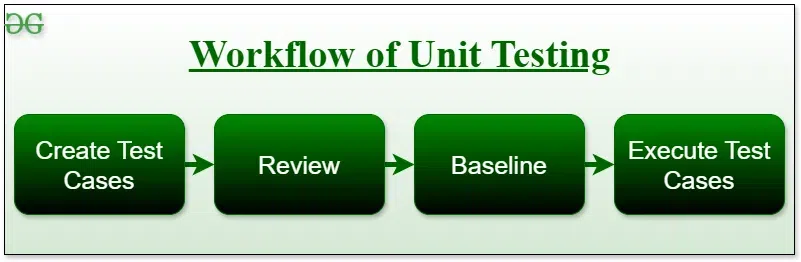

1. Create Test Case

   Writing the actual unit test cases for a specific function or method before review.

2. Review Test Case

   Peer or senior review of the created test cases for quality and completeness.

3. Baseline Test Case

   Officially approving and freezing the reviewed test cases as the standard version.

4. Execute Test Case

   Running the baselined test cases to verify the code behavior and generate results.

### Unit Testing Techniques

#### Black Box Testing

`Black Box Testing` is a technique where the system is tested based on inputs and expected outputs without any knowledge of internal code or logic. It focuses on validating functionality from a user’s perspective and ensures the system behaves correctly for given inputs.

#### White Box Testing

`White Box Testing` is a technique where the internal structure, logic, and code of the application are tested. It ensures that all code paths, conditions, and statements work correctly as expected.

#### Gray Box Testing

`Gray Box Testing` is a technique that combines both black box and white box testing approaches, where the tester has partial knowledge of the internal system. It helps in testing both functionality and some internal behaviors of the application.

### Benefits of Unit Testing

Advantages:

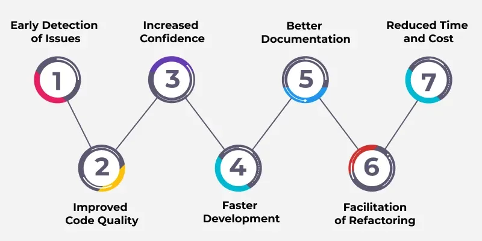

- Early Detection of Issues
- Improved Code Quality
- Increased Confidence
- Faster Development
- Better Documentation
- Facilitation of Refactoring
- Reduced Time and Cost

Disadvantage:

- Time and Effort
- Dependence on Developers
- Difficulty in Testing Complex Units
- Difficulty in Testing Interactions
- Difficulty in Testing User Interfaces
- Over-reliance on Automation
- Maintenance Overhead

## Integration Testing

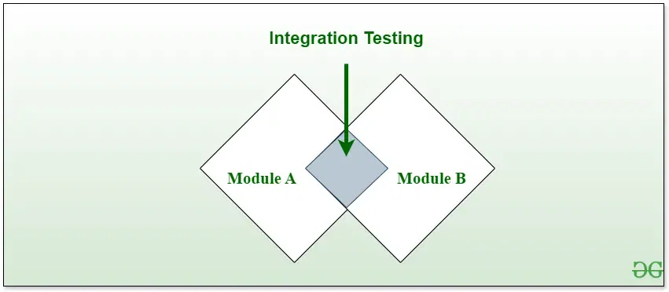

Integration Testing is a software testing technique that focuses on verifying the interactions and data exchange between different components or modules of a software application. The goal of integration testing is to identify any problems or bugs that arise when different components are combined and interact with each other.

### Integration Test Approaches

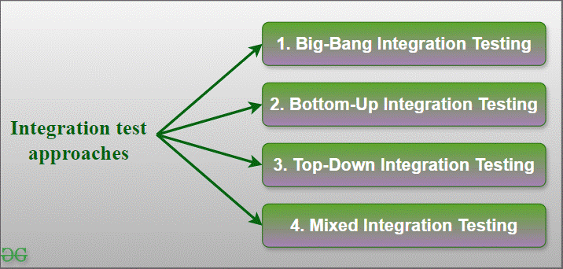

1. Big-Bang Integration Testing

   In Big Bang Integration Testing, all modules are integrated at once and tested together as a complete system.

   Advantags:

   - it is convenient for small systems.
   - Simple and straightforward approach.
   - Can be completed quickly.
   - Does not require a lot of planning or coordination.
   - May be suitable for small systems or projects with a low degree of interdependence between components.

   Disadvantages:

   - There will be quite a lot of delay because you would have to wait for all teh modules to be integrated.
   - High-risk critical modules are not isolated and tested on priority since all modules are tested at once.
   - Not good for long projects.
   - High risk of integration problems that are difficult to identify and diagnose.
   - This can result in long and complex debugging and troubleshooting efforts.
   - May not provide enough visibility into the interactions and data exchange between components.
   - This can result in a lack of confidence in the system's stability and reliability.
   - This can lead to decreased efficiency and productivity.
   - This may result in a lack of confidence in the development team.
   - This can lead to system failure and decreased user satisfaction.

2. Bottom-Up Integration Testing

   In Bottom-Up Integration Testing, lower-level modules are tested first, followed by the gradual integration of higher-level modules.

   Advantages:

   - In bottom-up testing, no stubs are required.
   - A principal advantage of this integration testing is that several disjoint subsystems can be tested simultaneously.
   - It is easy to create the test conditions.
   - Best for applications that uses bottom up design approach.
   - It is easy to observe the test results.

   Disadvantages:

   - Driver modules must be produced.
   - In this testing, the complexity that occurs when the system is made up of a large number of small subsystems.
   - As far as modules have been created, there is no working model can be represented.

3. Top-Down Integration Testing

   In Top-down Integration Testing, high-level modules are tested first, and lower-level modules are integrated step by step.

   Advantages:

   - Separately debugged module.
   - Few or no drivers needed.
   - It is more stable and accurate at the aggregate level.
   - Easier isolation of interface errors.
   - In this, design defects can be found in the early stages.

   Disadvantages:

   - Needs many stubs.
   - Modules at lower level are tested inadequately.
   - It is difficult to observe the test output.
   - It is difficult to stub design.

4. Mixed Integration Testing

   A combination of both top-down and bottom-up approaches is executed in parallel.

   Advantages:

   - Mixed approach is useful for very large projects having several sub projects.
   - This Sandwich approach overcomes this shortcoming of the top-down and bottom-up approaches.
   - Parallel test can be performed in top and bottom layer tests.

   Disadvantages:

   - For mixed integration testing, it requires very high cost because one part has a Top-down approach while another part has a bottom-up approach.
   - This integration testing cannot be used for smaller systems with huge interdependence between different modules.

### Integration Test Tools

Various tools and frameworks are used in integration testing to automate test execution, simulate dependencies, and ensure smooth interaction between components:

- Postman
- RestAssured
- Testcontainers
- JUnit/TestNG
- WireMock
- Pytest
- Jenkins / Github Actions

## Load Testing

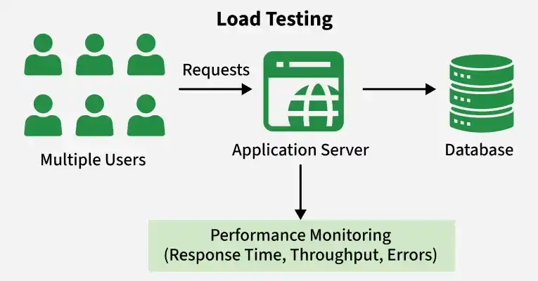

Load Testing is a type of performance testing that evaluates how a system performs under expected user load. It helps ensure the application remains stable, responsive, and efficient when multiple users access it simultaneously.

### Types of Load Testing

Load testing can be categorized into different types based on how the system is evaluated under varying load conditions.

- Baseline Testing

  Measures system performance under normal expected user load to establish a reference point.

- Incremental Load Testing

  Gradually increases the number of users to observe how performance changes as the load grows.

- Peak Load Testing

  Tests the system under maximum expected user traffic to ensure it performs well during high-demand periods.

- Break Point Testing

  Pushes the system beyond its limits to determine the point at which it fails or crashes.

### Load Testing Techniques

Different techniques are used in load testing to evaluate system behavior under various load conditions.

- Stress Testing

  Checks how the system performs under loads beyond normal usage.

- Spike Testing

  Evaluates system response to sudden traffic spikes.

- Soak Testing

  Assesses performance under a continuous load over an extended period.

### Load Testing Process

The load testing process involves a series of steps to evaluate system performance and identify potential issues under different load conditions.

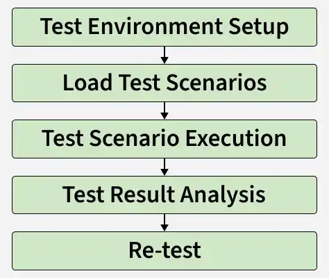

1. Test Environment Setup

   Create a dedicated environment similar to production (servers, network, database). This ensures accurate and realistic test results without affecting real users.

2. Create Test Scenarios

   Define user activities like login, search, transactions, etc. Prepare test data and decide number of users, load levels, and execution conditions.

3. Execute Tests

   Run the load test using tools with multiple virtual users. Monitor system behavior, response time, server load, and error rates during execution.

4. Analyze Results

   Examine collected data to find bottlenecks, slow responses, or failures. Identify root causes and suggest performance improvements.

5. Re-test if Needed

   After fixing issues, perform testing again to verify improvements and ensure the system meets performance requirements.

### Matrics of Load Testing

Measures system performance using metrics like response time, throughput, error rate, and resource utilization under varying load conditions.

- Average Response Time

  The average time the system takes to respond to user requests. It indicates how fast the application performs under load and directly affects user experience.

- Error Rate

  The percentage of failed or unsuccessful requests during testing. A higher error rate may signal server overload, configuration issues, or application defects.

- Throughput

  The amount of data processed or transferred per second during testing. It shows how much workload the system can handle efficiently.

- Requests Per Second (RPS)

  The number of requests the system processes each second. It helps measure how well the application manages incoming traffic.

- Concurrent Users

  The number of users actively using the system at the same time. This helps determine whether the system can handle peak usage periods.

- Peak Response Time

  The highest time taken by the system to respond to a request is usually observed during maximum load conditions. It helps identify performance bottlenecks and slow system behavior under heavy traffic.

## Stress Testing

Stress Testing is a software testing technique that evaluates how a system behaves under extreme load conditions beyond normal operating limits. It helps identify performance bottlenecks, system weaknesses, and recovery capabilities to ensure stability and reliability under pressure.

### Types of Stress Testing

Stress testing can be performed using different approaches based on what aspect of the system is being evaluated under extreme conditions:

1. Server-Client (Distributed) Stress Testing

   Tests how well a server handles multiple client requests simultaneously to ensure stability under heavy load.

2. Product Stress Testing

   Focuses on identifying issues within a specific application, such as performance bottlenecks, data conflicts, or network failures.

3. Transactional Stress Testing

   Evaluates how transactions between systems perform under high load conditions to ensure smooth processing.

4. Systematic Stress Testing

   Tests multiple applications on the same server to identify resource sharing issues and performance impact.

5. Analytical (Exploratory) Stress Testing

   Tests the system using unusual or extreme scenarios to evaluate behavior in rare but possible situations.

### Stress Testing Process

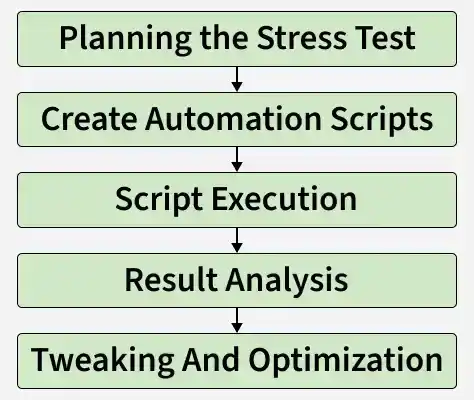

1. Planning

   Gather system details (server, database, traffic patterns), analyze current performance, and set clear goals (e.g., handle 10,000 users per minute with acceptable response time).

2. Create Test Scripts

   Develop automation scripts using stress testing tools and prepare realistic test data to simulate user activities.

3. Execute Tests

   Run the stress test in a controlled environment and gradually increase the load to observe system behavior.

4. Analyze Results

   Review logs and performance metrics to identify bottlenecks, failures, or slowdowns (e.g., CPU limits, database issues).

5. Optimize and Retest

   Fix identified issues, optimize system performance, and retest to ensure the system meets the desired benchmarks.

### Metrics of Stress Testing

Stress testing metrics are used to measure system performance under heavy load. Common metrics include:

- Pages per Second: Number of page requests handled per second.
- Page Load Time: Average time taken to fully load a page.
- Time to First Byte (TTFB): Time taken to receive the first byte of data from the server.
- Transaction Response Time: Average time required to complete a transaction.
- Transactions per Second (TPS): Number of successful transactions processed per second.
- Error/Failure Rate: Number of failed connections or unsuccessful system attempts.
- Test Rounds: Number of test cycles executed successfully and failed.

## Functional Testing

TODO

## Performance Testing

TODO

## Acceptance Testing

TODO

## Security Testing

TODO

## Summary

### Manual Testing vs Automated Testing

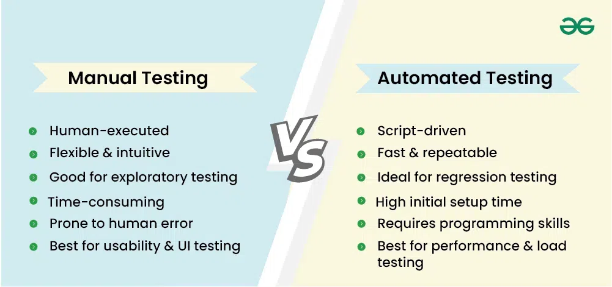

| Parameters                | Manual Testing                                               | Automation Testing                                           |
| ------------------------- | ------------------------------------------------------------ | ------------------------------------------------------------ |
| Definition                | In manual testing, the test cases are executed by the human tester. | In automated testing, the test cases are executed by the software tools. |
| Processing Time           | Manual testing is time-consuming.                            | Automation testing is faster than manual testing.            |
| Resources Requirement     | Manual testing takes up human resources.                     | Automation testing takes up automation tools and trained employees. |
| Exploratory Testing       | Exploratory testing is possible in manual testing.           | Exploratory testing is not possible in automation testing.   |
| Framework Requirement     | Manual testing doesn't use frameworks.                       | Automation testing uses frameworks like Data Driven, Keyword, etc. |
| Reliability               | Manual testing is not reliable due to the possibility of manual errors. | Automated testing is more reliable due to the use of automated tools and scripts. |
| Investment                | In manual testing, investment is required for human resoruces. | In automated testing, investment is required for tools and automated engineers. |
| Test Results Availability | In manual testing, the test results are recorded in an excel sheet so they are not readily available. | In automated testing, the test results are readily available to all the stakeholders in the dashboard of the automated tool. |
| Human Intervention        | Manual testing allows human observation, thus it is useful in developing user-friendly systems. | Automated testing is conducted by automated tools and scripts so it does not involve assurance of user-friendlines. |
| Performance Testing       | Impractical for systematic performance testing(e.g., load, stress, spike testing) | Supports performance testing(e.g., load, stress, spike testing with tools like JMeter). |
| Batch Testing             | In manual testing, batch testing is not possible.            | You can batch multiple tests for fast execution.             |
| Programming Knowledge     | There is no need for programming knowledge in manual testing. | Programming knowledge is a must in case of automation testing as using tools requires trained staff. |
| Documentation             | In manual testing, there is no documentation.                | In automation teting, the documentation acts as a training resource for new developer. He/She can look into unit test cases and understand the code base quickly. |
| When To Use?              | Manual testing is usable for Exploratory testing, Usability testing, and Adhoc testing. | Automated testing is suitable for Regression testing, Load testing, and Performance testing. |

### Test Tools

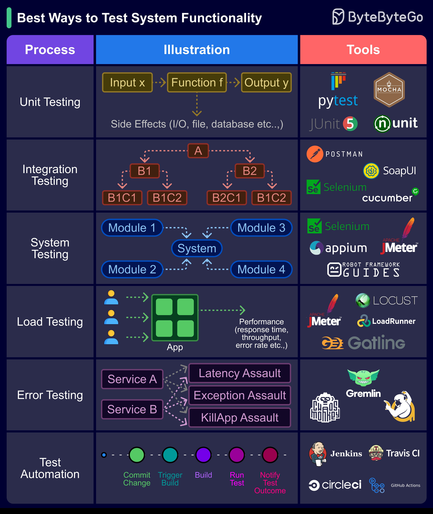

### Integration Testing Best Practices

Following best practices ensures that integration tests are reliable, maintainable, and effectively validate interactions between system components.

- Start testing only after unit-tested modules are ready and focus first on critical interfaces and high-risk integrations.
- Use realistic and well-structured test data while maintaining a clean and stable test environment.
- Automate repetitive integration tests and ensure proper logging of defects for easier debugging.
- Perform incremental testing along with regression testing after every fix or update.
- Mock or simulate external services to isolate system components and avoid dependency failures.
- Ensure continuous integration so that tests run automatically on code changes.

## Reference

[1] [Unit Testing - Software Testing](https://www.geeksforgeeks.org/software-testing/unit-testing-software-testing/)

[2] [Integration Testing - Software Engineering](https://www.geeksforgeeks.org/software-testing/software-engineering-integration-testing/)

[3] [Best ways to test system functionality](https://blog.bytebytego.com/p/ep170-best-ways-to-test-system-functionality)

[4] [Unit Testing](https://www.geeksforgeeks.org/software-testing/unit-testing-software-testing/)

[5] [Integration Testing](https://www.geeksforgeeks.org/software-testing/software-engineering-integration-testing/)

[6] [Load Testing - Software Testing](https://www.geeksforgeeks.org/software-testing/software-testing-load-testing/)

[7] [Stress Testing](https://www.geeksforgeeks.org/software-testing/stress-testing-software-testing/)