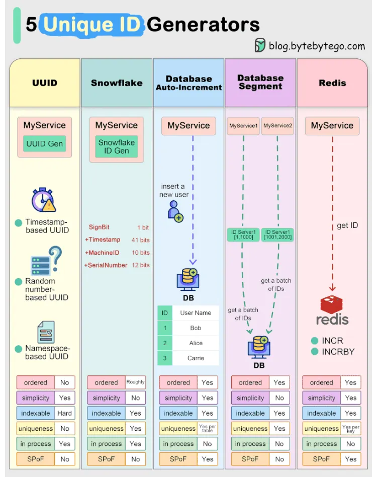
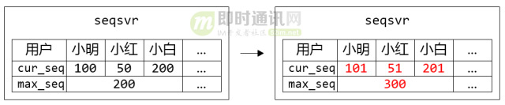
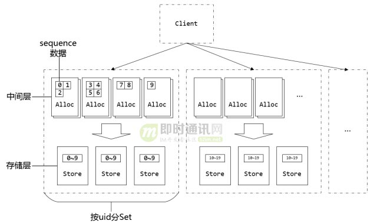
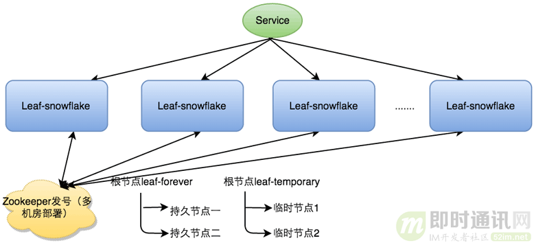
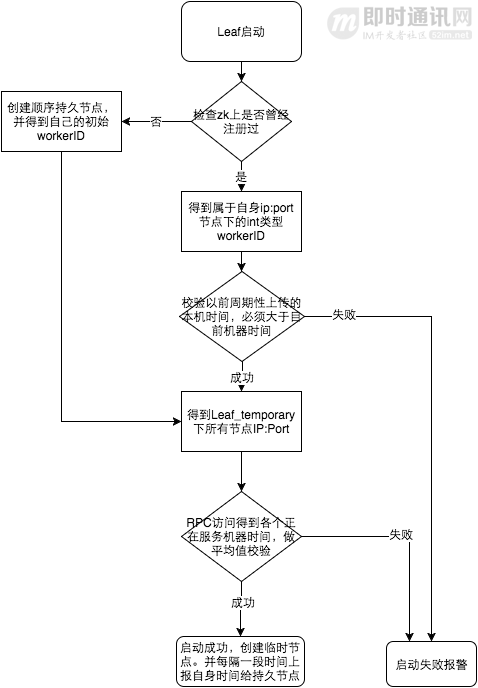

[中文版](uuid_zh.md) | English

# Unique ID Generation

[TOC]


## Generation



### SnowFlake

SnowFlake algorithm is Twitter's open-source distributed ID generation algorithm; its core idea is: use a 64-bit long type number as the global unique ID; its structure is as follows:

| Reserved (all 0) | Timestamp (ms) | Machine ID | Increment |
| ---------------- | -------------- | ---------- | --------- |
| 1bit             | 41bit          | 10bit      | 12bit     |

Disadvantages:

- Depends on machine clock, if the clock goes back, it may cause ID duplication or service unavailability;

### Database Auto-Increment

Utilize the auto-increment feature of database primary keys to obtain unique IDs when inserting;

Disadvantages:

- Depends on the database, fails when database is unavailable;
- ID consistency is hard to guarantee, ID duplication may occur during master-slave switch;
- Performance bottleneck is on the database, each ID generation requires database access.

Optimizations:

1. Can use segment number method, generate IDs through clusters;

### Database Segment

TODO

### Redis

TODO


## Examples

### IM System ID

Generating valid message IDs, avoiding message ID collisions is a difficult problem (network delay, debugging errors, etc. may cause collisions); to solve this, the ideas are as follows:

1. Prioritize message ID consistency
2. Prioritize message ID timing (WeChat's approach)

#### Tencent seqsvr

seqsvr is WeChat's high-availability, high-reliability message sequence number generator; used to provide incremental message sequence numbers (sequence) for WeChat messages;

sequence is an incremental 64-bit integer variable; due to the serious mutual exclusion problem of globally unique sequence, WeChat gives each user an independent 64-bit sequence system.

By adding a middle layer that pre-allocates sequences, it greatly improves the performance of allocating sequences while ensuring sequences do not roll back.

Example:

A table storing user sequences has the following structure:

| User | Xiao Ming | Xiao Hong | ... |
| ---- | --------- | --------- | --- |
| cur_seq | 100 | 200 | ... |
| max_seq | 200 | 200 | ... |

After Xiao Ming and Xiao Hong each apply for a sequence, the table structure is as follows:

| User | Xiao Ming | Xiao Hong | ... |
| ---- | --------- | --------- | --- |
| cur_seq | 101 | 201 | ... |
| max_seq | 200 | 300 | ... |

- The step here is 100, WeChat's actual step is 10000

WeChat's uid limit is 2^32, each user occupies 8 bytes of sequence space, total 2^32 * 8 = 34,359,738,368 about 32GB space to hold all sequences; the problem is: when restarting, it needs to read about 32GB of max_seq data into memory, which takes too much time.

Solved by introducing segments: adjacent users in a segment share a max_seq.

Example:

Improved table structure for storing user sequences:



When Xiao Ming, Xiao Hong, Xiao Bai each apply for a sequence, Xiao Bai breaks through max_seq, causing max_seq to upgrade;



#### Meituan Leaf-segment

Using the auto-increment ID feature when writing to the database, a common method to generate global unique IDs;

Leaf-segment improved the database auto-increment ID scheme, mainly making the following changes:

1. Original scheme requires read-write database every time to get ID, causing too much database pressure; changed to use proxy server to batch get, then get more when used up;
2. For IDs of different businesses, use biz_tag field to distinguish, later when database expansion is needed, use biz_tag to split tables and databases;
3. When a segment is almost used up, generate the next segment in advance.

Database table design:

```txt
+-------------+--------------+------+-----+-------------------+-----------------------------+
| Field       | Type         | Null | Key | Default           | Extra                       |
+-------------+--------------+------+-----+-------------------+-----------------------------+
| biz_tag     | varchar(128) | NO   | PRI |                   |                             |
| max_id      | bigint(20)   | NO   |     | 1                 |                             |
| step        | int(11)      | NO   |     | NULL              |                             |
| desc        | varchar(256) | YES  |     | NULL              |                             |
| update_time | timestamp    | NO   |     | CURRENT_TIMESTAMP | on update CURRENT_TIMESTAMP |
+-------------+--------------+------+-----+-------------------+-----------------------------+
```

- biz_tag business distinction;
- max_id the maximum value of the ID segment currently allocated for this biz_tag;
- step the length of the segment allocated each time.

Meituan Leaf-snowflake is an improvement on twitter-snowflake, retaining the bit design, and making the following modifications:

- Machine ID configuration changed from manual to ZooKeeper
  

  1. Start Leaf-snowflake service, connect to Zookeeper, check under leaf_forever parent node if already registered (has the sequential child node);
  2. If registered, directly retrieve own workerID (zk sequential node generated int type ID), start service;
  3. If not registered, create a persistent sequential node under the parent node, after creation, retrieve the sequence number as own workerID, start service.

- Solve "clock rollback problem"

  

#### Rongyun Scheme

Rongyun's ID structure:

| Timestamp (ms) | Increment ID | Session Type | Session ID |
| -------------- | ------------ | ------------ | ---------- |
| 42bit          | 12bit        | 4bit         | 22bit      |


## References

[1] [IM消息ID技术专题(一)：微信的海量IM聊天消息序列号生成实践（算法原理篇）](http://www.52im.net/forum.php?mod=viewthread&tid=1998&highlight=ID)

[2] [IM消息ID技术专题(二)：微信的海量IM聊天消息序列号生成实践（容灾方案篇）](http://www.52im.net/thread-1999-1-1.html)

[3] [IM消息ID技术专题(三)：解密融云IM产品的聊天消息ID生成策略](http://www.52im.net/thread-2747-1-1.html)

[4] [IM消息ID技术专题(四)：深度解密美团的分布式ID生成算法](http://www.52im.net/thread-2751-1-1.html)

[5] [IM消息ID技术专题(五)：开源分布式ID生成器UidGenerator的技术实现](http://www.52im.net/thread-2953-1-1.html)

[6] []

