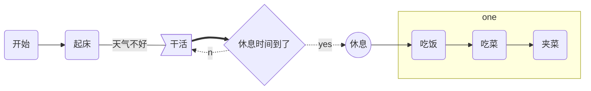

# 如何写markdown

参考自：

- [markdown 绘制流程图、时序图、甘特图](https://www.jianshu.com/p/6dbcc3aff98b)


## 标题

```
# 一级标题
## 二级标题
### 三级标题
#### 四级标题
##### 五级标题
###### 六级标题
```


## 段落

```
段落换行:2个空格+回车
重新开始段落:使用一个空行
```


## 字体

``` 
斜体:*字体*或_字体_
粗体:**字体*或__字体__
粗斜体:___字体___
```


## 分割线

```
***
* * *
******
- - -
----------
```


## 删除线

``` 
~~删除线~~ 
```


## 下划线

``` 
<u>下划线<u>
```


## 脚注

``` 
[^文字] -- 注释
```


## 列表

```
无序列表：*第一项 *第二项 *第三项 （*, +， - 都可以）
有序列表：1.第一项 2.第二项 3.第三项
列表嵌套：1.第一项：-嵌套 2.第二项：-嵌套
```


## 区块

```
普通区块：>区块1 >区块2
嵌套区块：>第一层 >>第二层
```


## 代码

```
方法一：用4个空格或一个制表符
方法二：用```编程语言
```


## 链接

```markdown
方法1：[链接名称](链接地址)
方法2：<链接地址>
高级用法：
	这个链接用 1 作为网址变量 [Google][1]
	这个链接用 runoob 作为网址变量 [Runoob][runoob]
	然后在文档的结尾为变量赋值（网址）
  		[1]: http://www.google.com/
    	[runoob]: http://www.runoob.com/
```


## 图片

```

```


## 表格

```
无对齐方式
|  表头  |  表头  |
|--------|--------|
| 单元格 | 单元格 |
| 单元格 | 单元格 |

对齐方式
-: 右对齐, :- 左对齐, :-: 居中
|  表头  |  表头  |
|:-------|-------:|
| 单元格 | 单元格 |
| 单元格 | 单元格 |

```


## 公式

```
$$公式内容$$
```
一些常用的数学公式：  
|写法|效果|
|:--|:--|
|`$\infty$, $\Delta$, $\Gamma$, $\Theta$, $\Lambda$, $\Sigma$, $\Upsilon$, $\Phi$, $\omega$`|$\infty$, $\Delta$, $\Gamma$, $\Theta$, $\Lambda$, $\Sigma$, $\Upsilon$, $\Phi$, $\omega$|
|`$\forall$, $\exists$, $\because$, $\therefore$`|$\forall$, $\exists$, $\because$, $\therefore$|
|`$x \in y$, $x \notin y$, $x \subset y$, $x \not\subset y$, $x \subseteq y$, $x \subsetneq y$`|$x \in y$, $x \notin y$, $x \subset y$, $x \not\subset y$, $x \subseteq y$, $x \subsetneq y$|
|`$x \cup y$, $x \cap y$, $x \setminus y$`|$x \cup y$, $x \cap y$, $x \setminus y$|
|`$\mathbb{R}$, $\mathbb{Z}$, $\emptyset$`|$\mathbb{R}$, $\mathbb{Z}$, $\emptyset$|
|`$x \pm y=z$, $x \mp y=z$, $x \times y=z$, $x \cdot y=z$, $x \ast y=z$, $x \div y=z$, $x/y=z$, $x \quad y$, $\oint$`|$x \pm y=z$, $x \mp y=z$, $x \times y=z$, $x \cdot y=z$, $x \ast y=z$, $x \div y=z$, $x/y=z$, $x \quad y$, $\oint$|
|`$x+y \geq z$, $x+y \leq z$, $x+y \neq z$, $x+y \approx z$, $x+y \equiv z$`|$x+y \geq z$, $x+y \leq z$, $x+y \neq z$, $x+y \approx z$, $x+y \equiv z$|
|`$\frac{7x+5}{1+y^2}$`|$\frac{7x+5}{1+y^2}$|
|`$a^b$, $z=z_l$, $\cdots$, $\sqrt{2}+\sqrt[n]{3}$`|$a^b$, $z=z_l$, $\cdots$, $\sqrt{2}+\sqrt[n]{3}$|
|`$\vec{a} \cdot \vec{b}=0$`|$\vec{a} \cdot \vec{b}=0$|
|`$\lim^{x \to \infty}_{y \to 0} {\frac{x}{y}}$`|$\lim^{x \to \infty}_{y \to 0} {\frac{x}{y}}$|
|`$\sum \frac{1}{i^2}$`|$\sum \frac{1}{i^2}$|
|`$\prod \frac{1}{i^2}$`|$\prod \frac{1}{i^2}$|
|`$\int^{\infty}_{0}{xdx}$`|$\int^{\infty}_{0}{xdx}$|
|`$\frac{\partial x}{\partial y}$`|$\frac{\partial x}{\partial y}$|
|`${n+1 \choose k}={n \choose k}+{n \choose k-1}$`|${n+1 \choose k}={n \choose k}+{n \choose k-1}$|
|`$\sum_{k_0,k_1,\ldots>0 \atop k_0+k_1+\cdots=n}A_{k_0}A_{k_1}\cdots$`|$\sum_{k_0,k_1,\ldots>0 \atop k_0+k_1+\cdots=n}A_{k_0}A_{k_1}\cdots$|
|`$\lfloor x \rfloor$`，`$\lceil x \rceil$`|$\lfloor x \rfloor$，$\lceil x \rceil$|

**矩阵的表示1:**

`$$ \begin{bmatrix}
1 & 2 & 3 \\
4 & 5 & 6 \\
7 & 8 & 9
\end{bmatrix} $$`

$$ \begin{bmatrix}
1 & 2 & 3 \\
4 & 5 & 6 \\
7 & 8 & 9
\end{bmatrix} $$

**矩阵的表示2:**

`$$ \begin{Bmatrix}
1 & 2 & 3 \\
4 & 5 & 6 \\
7 & 8 & 9
\end{Bmatrix} $$`

$$ \begin{Bmatrix}
1 & 2 & 3 \\
4 & 5 & 6 \\
7 & 8 & 9
\end{Bmatrix} $$


## 绘制流程图

### 样式流程图

基本语法:

- graph 指定流程图方向：
  - `graph LR` 从左到右(left right)
  - `graph TD` 从上到下(top bottom)
  - `graph RL` 从右到左(right left)
  - `graph BT` 从下到上(bottom top)
- 元素的形状定义
  - `id[描述]` 以直角矩形绘制
  - `id(描述)` 以圆角矩形绘制
  - `id{描述}` 以菱形绘制
  - `id>描述]` 以不对称矩形绘制
  - `id((描述))` 以圆形绘制
- 线条定义
	- `A-->B` 带箭头指向
	- `A---B` 不带箭头连接
	- `A-.-B` 虚线连接
	- `A-.->B` 虚线指向
	- `A==>B` 加粗箭头指向
	- `A--描述---B` 不带箭头指向并在线段中间添加描述
	- `A--描述-->B` 带描述的箭头指向
	- `A-.描述.->B` 带描述的虚线连指向
	- `A==描述==>B` 带描述的加粗箭头指向
- 子流程图定义
	```sh
	subgraph title
		graph direction
	end
	```

例:
```markdown
​```mermaid
graph LR
    A(开始) -->B(起床)
    B --天气不好--- C>干活]
    C ==> D{休息时间到了}
    D -.yes.-> E((休息))
    D -.no.-> C
    E --> F(吃饭)
	subgraph one
	F(吃饭)-->G(吃菜)-->H(夹菜)
	end
```



### 标准流程图
基本语法：

- 定义模块 
  `id=>关键字: 描述 （“描述”的前面必须有空格，“=>” 两端不能有空格）`

- 关键字：
  - start 流程开始，以圆角矩形绘制
  - opearation 操作，以直角矩形绘制
  - condition 判断，以菱形绘制
  - subroutine 子流程，以左右带空白框的矩形绘制
  - inputoutput 输入输出，以平行四边形绘制
  - end 流程结束，以圆角矩形绘制
  
- 定义模块间的流向：

  - `模块1 id->模块2 id` ：一般的箭头指向

  - `条件模块id (描述)->模块id(direction) `：条件模块跳转到对应的执行模块，并指定对应分支的布局方向

例:

```markdown
​```flow
st=>start: 开始框
op=>operation: 处理框
cond=>condition: 判断框（是或否?）
sub1=>subroutine: 子流程
io=>inputoutput: 输入输出框
e=>end: 结束框

st->op->cond
cond(yes)->io->e
cond(no)->sub1(right)->op
```

```flow
st=>start: 开始框
op=>operation: 处理框
cond=>condition: 判断框（是或否?）
sub1=>subroutine: 子流程
io=>inputoutput: 输入输出框
e=>end: 结束框

st->op->cond
cond(yes)->io->e
cond(no)->sub1(right)->op
```

## 绘制时序图

### 标准时序图

基本语法:

- `Title:标题`：指定时序图的标题

- `Note direction of 对象:描述`：在对象的某一侧添加描述，`direction` 可以为 `right/left/over` ， `对象` 可以是多个对象，以 `,` 作为分隔符

- `participant 对象` ：创建一个对象

- `loop...end` ：创建一个循环体

- `对象A->对象B:描述` ： 绘制A与B之间的对话，以实线连接

  线条：

  - `->` 实线实心箭头指向
  - `-->` 虚线实心箭头指向
  - `->>` 实线小箭头指向
  - `-->>` 虚线小箭头指向

例：

```markdown
​```sequence
Title:时序图示例
客户端->服务端: 我想找你拿下数据 SYN
服务端-->客户端: 我收到你的请求啦 ACK+SYN
客户端->>服务端: 我收到你的确认啦，我们开始通信吧 ACK
Note right of 服务端: 我是一个服务端
Note left of 客户端: 我是一个客户端
Note over 服务端,客户端: TCP 三次握手
participant 观察者
```

```sequence
Title:时序图示例
客户端->服务端: 我想找你拿下数据 SYN
服务端-->客户端: 我收到你的请求啦 ACK+SYN
客户端->>服务端: 我收到你的确认啦，我们开始通信吧 ACK
Note right of 服务端: 我是一个服务端
Note left of 客户端: 我是一个客户端
Note over 服务端,客户端: TCP 三次握手
participant 观察者
```

### 带样式时序图

基本语法同标准时序图，不同的是

- 需要使用 `mermaid` 解析，并在开头使用关键字 `sequenceDiagram` 指明

- 线段的样式遵循 

  ```
  mermaid
  ```

   的解析方式

  - `->` ： 实线连接
  - `-->` ：虚线连接
  - `->>` ：实线箭头指向
  - `-->>` ：虚线箭头指向

例：

~~~markdown
```mermaid
sequenceDiagram
对象A->对象B:中午吃什么？
对象B->>对象A: 随便
loop 思考
    对象A->对象A: 努力搜索
end
对象A-->>对象B: 火锅？
对象B->>对象A: 可以
Note left of 对象A: 我是一个对象A
Note right of 对象B: 我是一个对象B
participant 对象C
Note over 对象C: 我自己说了算
~~~

```mermaid
sequenceDiagram
对象A->对象B:中午吃什么？
对象B->>对象A: 随便
loop 思考
    对象A->对象A: 努力搜索
end
对象A-->>对象B: 火锅？
对象B->>对象A: 可以
Note left of 对象A: 我是一个对象A
Note right of 对象B: 我是一个对象B
participant 对象C
Note over 对象C: 我自己说了算
```


## 绘制甘特图

基本语法：

- 使用 `mermaid` 解析语言，在开头使用关键字 `gantt` 指明

- `deteFormat 格式` 指明日期的显示格式

- `title 标题` 设置图标的标题

- `section 描述` 定义纵向上的一个环节

- 定义步骤：每个步骤有两种状态`done`（已完成）/`active`（执行中）

  - `描述: 状态,id,开始日期,结束日期/持续时间`
  - `描述: 状态[,id],after id2,持续时间`
  - `crit` ：可用于标记该步骤需要被修正，将高亮显示
  - 如果不指定具体的开始时间或在某个步骤之后，将默认依次顺序排列

例：

~~~markdown
```mermaid
gantt
        dateFormat  YYYY-MM-DD

        title 软件开发甘特图

        section 设计
        需求:done,des1, 2019-01-06,2019-01-08
        原型:active,des2, 2019-01-09, 3d
        UI设计:des3, after des2, 5d
        未来任务:des4, after des3, 5d

        section 开发
        学习准备理解需求:crit, done, 2019-01-06,24h
        设计框架:crit, done, after des2, 2d
        开发:crit, active, 3d
        未来任务:crit, 5d
        休息时间:2d

        section 测试
        功能测试:active, a1, after des3, 3d
        压力测试:after a1, 20h
        测试报告: 48h
~~~

```mermaid
gantt
        dateFormat  YYYY-MM-DD

        title 软件开发甘特图

        section 设计
        需求:done,des1, 2019-01-06,2019-01-08
        原型:active,des2, 2019-01-09, 3d
        UI设计:des3, after des2, 5d
        未来任务:des4, after des3, 5d

        section 开发
        学习准备理解需求:crit, done, 2019-01-06,24h
        设计框架:crit, done, after des2, 2d
        开发:crit, active, 3d
        未来任务:crit, 5d
        休息时间:2d

        section 测试
        功能测试:active, a1, after des3, 3d
        压力测试:after a1, 20h
        测试报告: 48h
```

